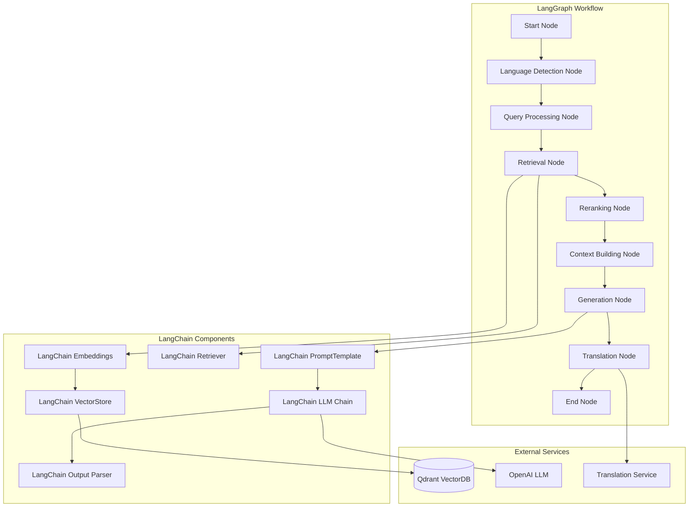

# RAG-архитектура с LangChain и LangGraph

## Обзор RAG системы

RAG (Retrieval-Augmented Generation) система построена на основе LangChain и LangGraph, объединяя поиск релевантной информации из корпоративной базы знаний с генерацией контекстуальных ответов через управляемые цепочки и графы.

## Архитектура RAG пайплайна с LangGraph



## Компоненты RAG системы с LangChain

### 1. Document Processing Pipeline

#### LangChain Text Splitters
```python
from langchain.text_splitter import (
    RecursiveCharacterTextSplitter,
    TokenTextSplitter,
    SemanticChunker
)
from langchain.schema import Document as LangChainDocument
from typing import List, Dict, Any

class LangChainDocumentProcessor:
    def __init__(self):
        # Рекурсивный сплиттер для общих документов
        self.recursive_splitter = RecursiveCharacterTextSplitter(
            chunk_size=1000,
            chunk_overlap=200,
            length_function=len,
            separators=["\n\n", "\n", " ", ""]
        )
        
        # Токен-базированный сплиттер для точного контроля
        self.token_splitter = TokenTextSplitter(
            chunk_size=800,
            chunk_overlap=100
        )
        
        # Семантический сплиттер для более умного разбиения
        self.semantic_splitter = SemanticChunker(
            embeddings=self.get_embeddings_model(),
            breakpoint_threshold_type="percentile"
        )
    
    async def process_document(
        self, 
        document: Document,
        content: str,
        splitter_type: str = "recursive"
    ) -> List[LangChainDocument]:
        """
        Обработка документа с использованием LangChain сплиттеров
        """
        # Создание LangChain документа
        langchain_doc = LangChainDocument(
            page_content=content,
            metadata={
                "document_id": document.id,
                "title": document.title,
                "category": document.category,
                "language": document.language,
                "file_type": document.file_type,
                "uploaded_by": document.uploaded_by
            }
        )
        
        # Выбор сплиттера
        if splitter_type == "recursive":
            splitter = self.recursive_splitter
        elif splitter_type == "token":
            splitter = self.token_splitter
        elif splitter_type == "semantic":
            splitter = self.semantic_splitter
        else:
            splitter = self.recursive_splitter
        
        # Разбиение документа
        chunks = splitter.split_documents([langchain_doc])
        
        # Добавление дополнительных метаданных к чанкам
        for i, chunk in enumerate(chunks):
            chunk.metadata.update({
                "chunk_index": i,
                "chunk_id": f"doc_{document.id}_chunk_{i}",
                "total_chunks": len(chunks)
            })
        
        return chunks
```

#### LangChain Embeddings
```python
from langchain.embeddings import (
    OpenAIEmbeddings,
    HuggingFaceEmbeddings,
    CacheBackedEmbeddings
)
from langchain.storage import LocalFileStore
from typing import List, Optional
import os

class LangChainEmbeddingService:
    def __init__(self, model_type: str = "openai"):
        self.model_type = model_type
        
        # Настройка различных embedding моделей
        if model_type == "openai":
            self.base_embeddings = OpenAIEmbeddings(
                model="text-embedding-ada-002",
                openai_api_key=os.getenv("OPENAI_API_KEY")
            )
        elif model_type == "huggingface":
            self.base_embeddings = HuggingFaceEmbeddings(
                model_name="sentence-transformers/paraphrase-multilingual-MiniLM-L12-v2",
                model_kwargs={'device': 'cpu'},
                encode_kwargs={'normalize_embeddings': True}
            )
        
        # Кэширование embeddings для оптимизации
        self.file_store = LocalFileStore("./storage/embeddings_cache/")
        self.cached_embeddings = CacheBackedEmbeddings.from_bytes_store(
            self.base_embeddings,
            self.file_store,
            namespace=f"embeddings_{model_type}"
        )
    
    async def embed_documents(self, texts: List[str]) -> List[List[float]]:
        """
        Генерация embeddings для документов с кэшированием
        """
        return await self.cached_embeddings.aembed_documents(texts)
    
    async def embed_query(self, text: str) -> List[float]:
        """
        Генерация embedding для поискового запроса
        """
        return await self.cached_embeddings.aembed_query(text)
    
    def get_embeddings_model(self):
        """
        Получение модели embeddings для использования в других компонентах
        """
        return self.cached_embeddings
```

### 2. LangChain Vector Store Integration

#### Qdrant Vector Store
```python
from langchain.vectorstores import Qdrant
from langchain.schema import Document as LangChainDocument
from qdrant_client import QdrantClient
from qdrant_client.models import Distance, VectorParams
from typing import List, Dict, Any, Optional

class LangChainVectorStore:
    def __init__(
        self, 
        embeddings_service: LangChainEmbeddingService,
        qdrant_url: str = "http://localhost:6333",
        collection_name: str = "documents"
    ):
        self.embeddings = embeddings_service.get_embeddings_model()
        self.collection_name = collection_name
        
        # Инициализация Qdrant клиента
        self.qdrant_client = QdrantClient(url=qdrant_url)
        
        # Создание LangChain Qdrant векторного хранилища
        self.vector_store = Qdrant(
            client=self.qdrant_client,
            collection_name=collection_name,
            embeddings=self.embeddings
        )
    
    async def initialize_collection(self, vector_size: int = 1536):
        """
        Инициализация коллекции в Qdrant
        """
        try:
            self.qdrant_client.create_collection(
                collection_name=self.collection_name,
                vectors_config=VectorParams(
                    size=vector_size,
                    distance=Distance.COSINE
                )
            )
        except Exception:
            # Коллекция уже существует
            pass
    
    async def add_documents(
        self, 
        documents: List[LangChainDocument],
        ids: Optional[List[str]] = None
    ) -> List[str]:
        """
        Добавление документов в векторное хранилище
        """
        return await self.vector_store.aadd_documents(
            documents=documents,
            ids=ids
        )
    
    async def similarity_search_with_score(
        self,
        query: str,
        k: int = 10,
        filter: Optional[Dict[str, Any]] = None,
        score_threshold: Optional[float] = None
    ) -> List[tuple[LangChainDocument, float]]:
        """
        Поиск похожих документов с оценками релевантности
        """
        return await self.vector_store.asimilarity_search_with_score(
            query=query,
            k=k,
            filter=filter,
            score_threshold=score_threshold
        )
    
    def as_retriever(
        self,
        search_type: str = "similarity",
        search_kwargs: Optional[Dict[str, Any]] = None
    ):
        """
        Создание LangChain Retriever из векторного хранилища
        """
        return self.vector_store.as_retriever(
            search_type=search_type,
            search_kwargs=search_kwargs or {"k": 10}
        )
```

### 3. LangGraph Workflow for Query Processing

#### LangGraph State and Nodes
```python
from langgraph.graph import StateGraph, END
from langchain.schema import BaseMessage
from typing import TypedDict, List, Dict, Any
import operator

class RAGState(TypedDict):
    """Состояние RAG workflow"""
    query: str
    user_id: int
    language: str
    processed_query: str
    retrieved_docs: List[LangChainDocument]
    context: str
    response: str
    metadata: Dict[str, Any]
    messages: List[BaseMessage]

class LangGraphRAGWorkflow:
    def __init__(
        self,
        embeddings_service: LangChainEmbeddingService,
        vector_store: LangChainVectorStore,
        llm_service
    ):
        self.embeddings = embeddings_service
        self.vector_store = vector_store
        self.llm = llm_service
        
        # Создание графа
        self.workflow = StateGraph(RAGState)
        self._build_workflow()
    
    def _build_workflow(self):
        """Построение LangGraph workflow"""
        
        # Добавление узлов
        self.workflow.add_node("detect_language", self.detect_language_node)
        self.workflow.add_node("process_query", self.process_query_node)
        self.workflow.add_node("retrieve_documents", self.retrieve_documents_node)
        self.workflow.add_node("rerank_documents", self.rerank_documents_node)
        self.workflow.add_node("build_context", self.build_context_node)
        self.workflow.add_node("generate_response", self.generate_response_node)
        self.workflow.add_node("translate_response", self.translate_response_node)
        
        # Определение маршрутов
        self.workflow.set_entry_point("detect_language")
        
        self.workflow.add_edge("detect_language", "process_query")
        self.workflow.add_edge("process_query", "retrieve_documents")
        self.workflow.add_edge("retrieve_documents", "rerank_documents")
        self.workflow.add_edge("rerank_documents", "build_context")
        self.workflow.add_edge("build_context", "generate_response")
        
        # Условный маршрут для перевода
        self.workflow.add_conditional_edges(
            "generate_response",
            self.should_translate,
            {
                "translate": "translate_response",
                "end": END
            }
        )
        
        self.workflow.add_edge("translate_response", END)
        
        # Компиляция графа
        self.app = self.workflow.compile()
    
    async def detect_language_node(self, state: RAGState) -> RAGState:
        """Узел определения языка"""
        from langdetect import detect
        
        try:
            detected_language = detect(state["query"])
            state["language"] = detected_language
        except:
            state["language"] = "ru"  # Fallback
        
        state["metadata"]["language_detected"] = state["language"]
        return state
    
    async def process_query_node(self, state: RAGState) -> RAGState:
        """Узел обработки запроса"""
        from langchain.prompts import PromptTemplate
        from langchain.chains import LLMChain
        
        # Шаблон для улучшения запроса
        query_enhancement_template = PromptTemplate(
            input_variables=["query", "language"],
            template="""
            Improve the following search query for better document retrieval.
            Add relevant synonyms and related terms while keeping the original meaning.
            
            Original query ({language}): {query}
            
            Enhanced query:
            """
        )
        
        chain = LLMChain(llm=self.llm, prompt=query_enhancement_template)
        
        enhanced_query = await chain.arun(
            query=state["query"],
            language=state["language"]
        )
        
        state["processed_query"] = enhanced_query.strip()
        return state
    
    async def retrieve_documents_node(self, state: RAGState) -> RAGState:
        """Узел поиска документов"""
        retriever = self.vector_store.as_retriever(
            search_type="similarity_score_threshold",
            search_kwargs={
                "k": 20,
                "score_threshold": 0.7
            }
        )
        
        retrieved_docs = await retriever.aget_relevant_documents(
            state["processed_query"]
        )
        
        state["retrieved_docs"] = retrieved_docs
        state["metadata"]["retrieved_count"] = len(retrieved_docs)
        return state
    
    async def rerank_documents_node(self, state: RAGState) -> RAGState:
        """Узел переранжирования документов"""
        from langchain.document_transformers import LongContextReorder
        
        # Переранжирование для оптимального порядка
        reorderer = LongContextReorder()
        reranked_docs = reorderer.transform_documents(state["retrieved_docs"])
        
        # Ограничение количества документов
        state["retrieved_docs"] = reranked_docs[:10]
        return state
    
    async def build_context_node(self, state: RAGState) -> RAGState:
        """Узел построения контекста"""
        context_parts = []
        
        for i, doc in enumerate(state["retrieved_docs"]):
            context_parts.append(
                f"Документ {i+1}:\n{doc.page_content}\n"
                f"Источник: {doc.metadata.get('title', 'Неизвестно')}\n"
            )
        
        state["context"] = "\n".join(context_parts)
        state["metadata"]["context_length"] = len(state["context"])
        return state
    
    async def generate_response_node(self, state: RAGState) -> RAGState:
        """Узел генерации ответа"""
        from langchain.prompts import PromptTemplate
        from langchain.chains import LLMChain
        
        response_template = PromptTemplate(
            input_variables=["query", "context", "language"],
            template="""
            Ты - корпоративный помощник для онбординга сотрудников.
            Используй предоставленный контекст для ответа на вопрос пользователя.
            
            Контекст:
            {context}
            
            Вопрос пользователя: {query}
            Язык ответа: {language}
            
            Инструкции:
            - Отвечай на языке пользователя ({language})
            - Будь конкретным и полезным
            - Если информации недостаточно, скажи об этом честно
            - Ссылайся на источники из контекста
            - Поддерживай дружелюбный профессиональный тон
            
            Ответ:
            """
        )
        
        chain = LLMChain(llm=self.llm, prompt=response_template)
        
        response = await chain.arun(
            query=state["query"],
            context=state["context"],
            language=state["language"]
        )
        
        state["response"] = response.strip()
        return state
    
    async def translate_response_node(self, state: RAGState) -> RAGState:
        """Узел перевода ответа"""
        # Здесь можно добавить логику перевода если нужно
        # Пока просто возвращаем состояние без изменений
        return state
    
    def should_translate(self, state: RAGState) -> str:
        """Условие для определения необходимости перевода"""
        # Если язык не русский и не английский, переводим
        if state["language"] not in ["ru", "en"]:
            return "translate"
        return "end"
    
    async def process_query(
        self,
        query: str,
        user_id: int,
        metadata: Optional[Dict[str, Any]] = None
    ) -> Dict[str, Any]:
        """
        Основной метод обработки запроса через LangGraph
        """
        initial_state = RAGState(
            query=query,
            user_id=user_id,
            language="",
            processed_query="",
            retrieved_docs=[],
            context="",
            response="",
            metadata=metadata or {},
            messages=[]
        )
        
        # Выполнение workflow
        final_state = await self.app.ainvoke(initial_state)
        
        return {
            "response": final_state["response"],
            "context": final_state["context"],
            "language": final_state["language"],
            "retrieved_docs_count": len(final_state["retrieved_docs"]),
            "metadata": final_state["metadata"]
        }
```

### 4. Advanced LangChain Chains

#### Multi-Step Reasoning Chain
```python
from langchain.chains import SequentialChain, LLMChain
from langchain.prompts import PromptTemplate
from langchain.output_parsers import PydanticOutputParser
from pydantic import BaseModel, Field
from typing import List

class ReasoningStep(BaseModel):
    step: int = Field(description="Номер шага рассуждения")
    thought: str = Field(description="Мысль или рассуждение на этом шаге")
    action: str = Field(description="Действие, которое нужно предпринять")
    result: str = Field(description="Результат действия")

class ReasoningChain(BaseModel):
    steps: List[ReasoningStep] = Field(description="Шаги рассуждения")
    final_answer: str = Field(description="Финальный ответ")

class MultiStepReasoningChain:
    def __init__(self, llm):
        self.llm = llm
        self.parser = PydanticOutputParser(pydantic_object=ReasoningChain)
        
        # Шаблон для анализа запроса
        self.analysis_template = PromptTemplate(
            input_variables=["query", "context"],
            template="""
            Проанализируй следующий запрос пользователя и контекст.
            Определи, требует ли запрос многошагового рассуждения.
            
            Запрос: {query}
            Контекст: {context}
            
            Если запрос сложный, разбей его на логические шаги.
            Если простой, дай прямой ответ.
            
            {format_instructions}
            """,
            partial_variables={"format_instructions": self.parser.get_format_instructions()}
        )
        
        # Цепочка анализа
        self.analysis_chain = LLMChain(
            llm=self.llm,
            prompt=self.analysis_template,
            output_parser=self.parser
        )
    
    async def process_complex_query(
        self,
        query: str,
        context: str
    ) -> ReasoningChain:
        """
        Обработка сложного запроса с многошаговым рассуждением
        """
        reasoning = await self.analysis_chain.arun(
            query=query,
            context=context
        )
        
        return reasoning
```

#### Conversational RAG Chain
```python
from langchain.chains import ConversationalRetrievalChain
from langchain.memory import ConversationBufferWindowMemory
from langchain.schema import BaseMessage

class ConversationalRAGService:
    def __init__(
        self,
        llm,
        vector_store: LangChainVectorStore,
        memory_window: int = 10
    ):
        self.llm = llm
        self.vector_store = vector_store
        
        # Память для хранения истории диалога
        self.memory = ConversationBufferWindowMemory(
            k=memory_window,
            memory_key="chat_history",
            return_messages=True,
            output_key="answer"
        )
        
        # Создание conversational retrieval chain
        self.chain = ConversationalRetrievalChain.from_llm(
            llm=self.llm,
            retriever=self.vector_store.as_retriever(),
            memory=self.memory,
            return_source_documents=True,
            verbose=True
        )
    
    async def chat(
        self,
        query: str,
        user_id: int
    ) -> Dict[str, Any]:
        """
        Диалоговый интерфейс с учетом истории
        """
        result = await self.chain.acall({
            "question": query,
            "chat_history": self.memory.chat_memory.messages
        })
        
        return {
            "answer": result["answer"],
            "source_documents": [
                {
                    "content": doc.page_content,
                    "metadata": doc.metadata
                }
                for doc in result["source_documents"]
            ],
            "chat_history": [
                {
                    "type": msg.type,
                    "content": msg.content
                }
                for msg in self.memory.chat_memory.messages
            ]
        }
    
    def clear_memory(self):
        """Очистка памяти диалога"""
        self.memory.clear()
```

### 5. LangChain Tools Integration

#### Custom Tools for Corporate Functions
```python
from langchain.tools import BaseTool
from typing import Optional, Type
from pydantic import BaseModel, Field

class UserSearchInput(BaseModel):
    query: str = Field(description="Поисковый запрос для поиска пользователей")
    department: Optional[str] = Field(description="Департамент для фильтрации")

class UserSearchTool(BaseTool):
    name = "user_search"
    description = "Поиск сотрудников по имени, департаменту или должности"
    args_schema: Type[BaseModel] = UserSearchInput
    
    def __init__(self, user_service):
        super().__init__()
        self.user_service = user_service
    
    async def _arun(
        self,
        query: str,
        department: Optional[str] = None
    ) -> str:
        """Асинхронный поиск пользователей"""
        users = await self.user_service.search_users(
            query=query,
            department=department
        )
        
        if not users:
            return "Пользователи не найдены"
        
        result = "Найденные сотрудники:\n"
        for user in users[:5]:  # Ограничиваем до 5 результатов
            result += f"- {user.first_name} {user.last_name} ({user.department})\n"
        
        return result

class DocumentSearchInput(BaseModel):
    query: str = Field(description="Поисковый запрос для поиска документов")
    category: Optional[str] = Field(description="Категория документов")

class DocumentSearchTool(BaseTool):
    name = "document_search"
    description = "Поиск корпоративных документов по содержимому или метаданным"
    args_schema: Type[BaseModel] = DocumentSearchInput
    
    def __init__(self, document_service):
        super().__init__()
        self.document_service = document_service
    
    async def _arun(
        self,
        query: str,
        category: Optional[str] = None
    ) -> str:
        """Асинхронный поиск документов"""
        documents = await self.document_service.search_documents(
            query=query,
            category=category
        )
        
        if not documents:
            return "Документы не найдены"
        
        result = "Найденные документы:\n"
        for doc in documents[:3]:  # Ограничиваем до 3 результатов
            result += f"- {doc.title} ({doc.category})\n"
        
        return result
```

#### Agent with Tools
```python
from langchain.agents import AgentExecutor, create_openai_tools_agent
from langchain.prompts import ChatPromptTemplate

class CorporateAssistantAgent:
    def __init__(
        self,
        llm,
        user_service,
        document_service,
        vector_store: LangChainVectorStore
    ):
        self.llm = llm
        
        # Создание инструментов
        self.tools = [
            UserSearchTool(user_service),
            DocumentSearchTool(document_service),
            # Можно добавить больше инструментов
        ]
        
        # Системный промпт для агента
        self.system_prompt = ChatPromptTemplate.from_messages([
            ("system", """
            Ты - корпоративный помощник для онбординга новых сотрудников.
            У тебя есть доступ к следующим инструментам:
            - user_search: для поиска информации о сотрудниках
            - document_search: для поиска корпоративных документов
            
            Используй эти инструменты, когда пользователь спрашивает о:
            - Контактах сотрудников
            - Корпоративных процедурах и документах
            - Политиках компании
            
            Всегда будь вежливым и профессиональным.
            Если не можешь найти информацию, честно скажи об этом.
            """),
            ("human", "{input}"),
            ("placeholder", "{agent_scratchpad}")
        ])
        
        # Создание агента
        self.agent = create_openai_tools_agent(
            llm=self.llm,
            tools=self.tools,
            prompt=self.system_prompt
        )
        
        # Создание executor
        self.agent_executor = AgentExecutor(
            agent=self.agent,
            tools=self.tools,
            verbose=True,
            max_iterations=3
        )
    
    async def process_query(self, query: str, user_id: int) -> str:
        """
        Обработка запроса через агента с инструментами
        """
        result = await self.agent_executor.ainvoke({
            "input": query,
            "user_id": user_id
        })
        
        return result["output"]
```

## Интеграция с Telegram Bot

### LangChain Integration in Bot Handlers
```python
from aiogram import Router, F
from aiogram.types import Message
from aiogram.filters import Command

class LangChainBotHandlers:
    def __init__(
        self,
        rag_workflow: LangGraphRAGWorkflow,
        conversational_rag: ConversationalRAGService,
        agent: CorporateAssistantAgent
    ):
        self.rag_workflow = rag_workflow
        self.conversational_rag = conversational_rag
        self.agent = agent
        self.router = Router()
        
        # Регистрация хендлеров
        self.router.message(Command("search"))(self.search_command)
        self.router.message(Command("chat"))(self.chat_command)
        self.router.message(Command("agent"))(self.agent_command)
        self.router.message(F.text)(self.handle_text_message)
    
    async def search_command(self, message: Message, user: User):
        """Обработка команды поиска через RAG"""
        query = message.text.replace("/search", "").strip()
        
        if not query:
            await message.answer("Пожалуйста, укажите поисковый запрос после команды /search")
            return
        
        # Обработка через LangGraph RAG workflow
        result = await self.rag_workflow.process_query(
            query=query,
            user_id=user.id
        )
        
        response_text = result["response"]
        
        # Добавление информации об источниках
        if result["retrieved_docs_count"] > 0:
            response_text += f"\n\n📚 Найдено документов: {result['retrieved_docs_count']}"
        
        await message.answer(response_text)
    
    async def chat_command(self, message: Message, user: User):
        """Обработка диалогового режима"""
        query = message.text.replace("/chat", "").strip()
        
        if not query:
            await message.answer("Начинаем диалог! Задайте ваш вопрос.")
            return
        
        # Обработка через conversational RAG
        result = await self.conversational_rag.chat(
            query=query,
            user_id=user.id
        )
        
        await message.answer(result["answer"])
    