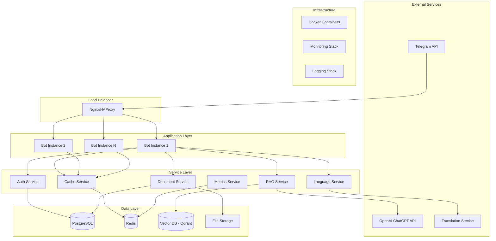

# Архитектура Telegram-бота для онбординга сотрудников

## Общее описание системы

Telegram-бот для онбординга новых сотрудников с интеграцией ChatGPT API, поддержкой RAG-архитектуры, многоязычности и векторного поиска по корпоративным документам.

## Высокоуровневая архитектура

## Основные компоненты

### 1. Telegram Bot Layer
- **Webhook Handler**: Обработка входящих сообщений от Telegram
- **Message Router**: Маршрутизация сообщений по обработчикам
- **Response Builder**: Формирование ответов с динамическими кнопками
- **Session Manager**: Управление состоянием пользовательских сессий

### 2. Authentication & Authorization Service
- **User Management**: Регистрация и управление пользователями
- **Role-Based Access Control**: Система ролей (admin, hr, employee)
- **Permission Manager**: Проверка прав доступа к функциям
- **Session Security**: Безопасность пользовательских сессий

### 3. Document Processing Service
- **File Parser**: Обработка PDF, DOCX, TXT файлов
- **Content Extractor**: Извлечение текста и метаданных
- **Document Indexer**: Индексация документов для поиска
- **Version Control**: Управление версиями документов

### 4. RAG (Retrieval-Augmented Generation) Service
- **Vector Search Engine**: Поиск релевантных документов
- **Context Builder**: Формирование контекста для GPT
- **Response Generator**: Генерация ответов через ChatGPT API
- **Relevance Scorer**: Оценка релевантности найденных документов

### 5. Language Service
- **Language Detector**: Автоматическое определение языка
- **Translation Engine**: Перевод текстов (русский, английский, арабский)
- **Localization Manager**: Управление локализованными ресурсами
- **Content Adapter**: Адаптация контента под язык пользователя

### 6. Caching Service
- **Query Cache**: Кэширование частых запросов
- **Document Cache**: Кэширование обработанных документов
- **Session Cache**: Кэширование пользовательских сессий
- **Response Cache**: Кэширование сгенерированных ответов

### 7. Monitoring & Logging Service
- **Usage Analytics**: Метрики использования бота
- **Performance Monitoring**: Мониторинг производительности
- **Error Tracking**: Отслеживание и логирование ошибок
- **Audit Logging**: Журналирование действий пользователей

## Технологический стек

### Backend
- **Python 3.11+**: Основной язык разработки
- **FastAPI**: Web framework для API
- **aiogram 3.x**: Telegram Bot framework
- **SQLAlchemy 2.x**: ORM для работы с БД
- **Alembic**: Миграции базы данных

### Базы данных
- **PostgreSQL 15+**: Основная реляционная БД
- **Redis 7+**: Кэширование и сессии
- **Qdrant**: Векторная база данных для embeddings

### AI/ML
- **OpenAI GPT-4**: Генерация ответов
- **sentence-transformers**: Создание embeddings
- **langdetect**: Определение языка
- **googletrans**: Перевод текстов

### Обработка документов
- **PyPDF2/pdfplumber**: Обработка PDF
- **python-docx**: Обработка DOCX
- **chardet**: Определение кодировки текста

### Инфраструктура
- **Docker & Docker Compose**: Контейнеризация
- **Nginx**: Reverse proxy и load balancer
- **Prometheus + Grafana**: Мониторинг
- **ELK Stack**: Логирование

## Принципы архитектуры

### 1. Масштабируемость
- Горизонтальное масштабирование bot instances
- Микросервисная архитектура
- Асинхронная обработка запросов
- Кэширование на всех уровнях

### 2. Надежность
- Graceful error handling
- Circuit breaker pattern
- Retry mechanisms
- Health checks

### 3. Безопасность
- Role-based access control
- API rate limiting
- Input validation
- Secure configuration management

### 4. Производительность
- Векторный поиск для быстрого retrieval
- Многоуровневое кэширование
- Асинхронная обработка
- Connection pooling

### 5. Мониторинг
- Comprehensive logging
- Metrics collection
- Performance monitoring
- Error tracking