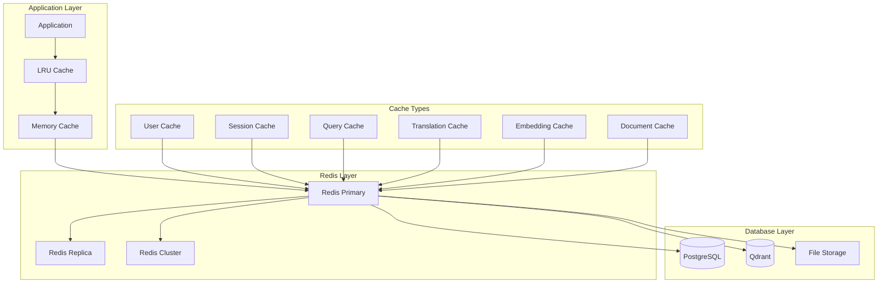

# Система кэширования и оптимизация производительности

## Обзор системы кэширования

Многоуровневая система кэширования для оптимизации производительности Telegram-бота с использованием Redis, in-memory кэша и кэширования на уровне приложения.

## Архитектура кэширования



## Компоненты системы кэширования

### 1. Cache Manager

#### Центральный менеджер кэша
```python
from typing import Any, Optional, Dict, List, Union
import redis.asyncio as redis
import json
import pickle
import hashlib
from datetime import datetime, timedelta
from enum import Enum

class CacheLevel(Enum):
    MEMORY = "memory"
    REDIS = "redis"
    PERSISTENT = "persistent"

class CacheStrategy(Enum):
    LRU = "lru"
    LFU = "lfu"
    TTL = "ttl"
    WRITE_THROUGH = "write_through"
    WRITE_BACK = "write_back"

class CacheManager:
    def __init__(
        self,
        redis_url: str,
        memory_cache_size: int = 1000,
        default_ttl: int = 3600
    ):
        self.redis_pool = redis.ConnectionPool.from_url(redis_url)
        self.redis_client = redis.Redis(connection_pool=self.redis_pool)
        self.memory_cache = {}
        self.memory_cache_size = memory_cache_size
        self.default_ttl = default_ttl
        self.cache_stats = {
            "hits": 0,
            "misses": 0,
            "memory_hits": 0,
            "redis_hits": 0
        }
        
    async def get(
        self,
        key: str,
        cache_level: CacheLevel = CacheLevel.REDIS,
        deserializer: str = "json"
    ) -> Optional[Any]:
        """
        Получение значения из кэша
        """
        try:
            # Проверка memory cache
            if cache_level in [CacheLevel.MEMORY, CacheLevel.REDIS]:
                if key in self.memory_cache:
                    entry = self.memory_cache[key]
                    if not self._is_expired(entry):
                        self.cache_stats["hits"] += 1
                        self.cache_stats["memory_hits"] += 1
                        return entry["value"]
                    else:
                        del self.memory_cache[key]
            
            # Проверка Redis cache
            if cache_level == CacheLevel.REDIS:
                redis_value = await self.redis_client.get(key)
                if redis_value:
                    self.cache_stats["hits"] += 1
                    self.cache_stats["redis_hits"] += 1
                    
                    # Десериализация
                    value = self._deserialize(redis_value, deserializer)
                    
                    # Сохранение в memory cache
                    await self._set_memory_cache(key, value, self.default_ttl)
                    
                    return value
            
            self.cache_stats["misses"] += 1
            return None
            
        except Exception as e:
            print(f"Cache get error: {e}")
            return None
    
    async def set(
        self,
        key: str,
        value: Any,
        ttl: Optional[int] = None,
        cache_level: CacheLevel = CacheLevel.REDIS,
        serializer: str = "json"
    ) -> bool:
        """
        Сохранение значения в кэш
        """
        try:
            ttl = ttl or self.default_ttl
            
            # Сохранение в memory cache
            if cache_level in [CacheLevel.MEMORY, CacheLevel.REDIS]:
                await self._set_memory_cache(key, value, ttl)
            
            # Сохранение в Redis
            if cache_level == CacheLevel.REDIS:
                serialized_value = self._serialize(value, serializer)
                await self.redis_client.setex(key, ttl, serialized_value)
            
            return True
            
        except Exception as e:
            print(f"Cache set error: {e}")
            return False
    
    async def delete(self, key: str) -> bool:
        """
        Удаление значения из кэша
        """
        try:
            # Удаление из memory cache
            if key in self.memory_cache:
                del self.memory_cache[key]
            
            # Удаление из Redis
            await self.redis_client.delete(key)
            
            return True
            
        except Exception as e:
            print(f"Cache delete error: {e}")
            return False
    
    async def _set_memory_cache(self, key: str, value: Any, ttl: int):
        """
        Сохранение в memory cache с LRU eviction
        """
        # Проверка размера кэша
        if len(self.memory_cache) >= self.memory_cache_size:
            # LRU eviction - удаление самого старого элемента
            oldest_key = min(
                self.memory_cache.keys(),
                key=lambda k: self.memory_cache[k]["accessed_at"]
            )
            del self.memory_cache[oldest_key]
        
        # Сохранение значения
        self.memory_cache[key] = {
            "value": value,
            "expires_at": datetime.utcnow() + timedelta(seconds=ttl),
            "accessed_at": datetime.utcnow()
        }
    
    def _is_expired(self, entry: Dict[str, Any]) -> bool:
        """
        Проверка истечения срока действия
        """
        return datetime.utcnow() > entry["expires_at"]
    
    def _serialize(self, value: Any, serializer: str) -> bytes:
        """
        Сериализация значения
        """
        if serializer == "json":
            return json.dumps(value, ensure_ascii=False).encode('utf-8')
        elif serializer == "pickle":
            return pickle.dumps(value)
        else:
            return str(value).encode('utf-8')
    
    def _deserialize(self, value: bytes, deserializer: str) -> Any:
        """
        Десериализация значения
        """
        if deserializer == "json":
            return json.loads(value.decode('utf-8'))
        elif deserializer == "pickle":
            return pickle.loads(value)
        else:
            return value.decode('utf-8')
    
    async def get_stats(self) -> Dict[str, Any]:
        """
        Получение статистики кэша
        """
        total_requests = self.cache_stats["hits"] + self.cache_stats["misses"]
        hit_rate = (self.cache_stats["hits"] / total_requests * 100) if total_requests > 0 else 0
        
        redis_info = await self.redis_client.info("memory")
        
        return {
            "hit_rate": round(hit_rate, 2),
            "total_requests": total_requests,
            "memory_cache_size": len(self.memory_cache),
            "redis_memory_usage": redis_info.get("used_memory_human", "N/A"),
            "stats": self.cache_stats
        }
```

### 2. Specialized Cache Services

#### User Cache Service
```python
class UserCacheService:
    def __init__(self, cache_manager: CacheManager):
        self.cache = cache_manager
        self.user_ttl = 1800  # 30 минут
        self.session_ttl = 3600  # 1 час
        
    async def get_user(self, user_id: int) -> Optional[Dict[str, Any]]:
        """
        Получение пользователя из кэша
        """
        cache_key = f"user:{user_id}"
        return await self.cache.get(cache_key)
    
    async def set_user(self, user_id: int, user_data: Dict[str, Any]) -> bool:
        """
        Сохранение пользователя в кэш
        """
        cache_key = f"user:{user_id}"
        return await self.cache.set(cache_key, user_data, self.user_ttl)
    
    async def get_user_permissions(self, user_id: int) -> Optional[List[str]]:
        """
        Получение разрешений пользователя из кэша
        """
        cache_key = f"user_permissions:{user_id}"
        return await self.cache.get(cache_key)
    
    async def set_user_permissions(self, user_id: int, permissions: List[str]) -> bool:
        """
        Сохранение разрешений пользователя в кэш
        """
        cache_key = f"user_permissions:{user_id}"
        return await self.cache.set(cache_key, permissions, self.user_ttl)
    
    async def get_user_session(self, telegram_id: int) -> Optional[Dict[str, Any]]:
        """
        Получение пользовательской сессии
        """
        cache_key = f"session:{telegram_id}"
        return await self.cache.get(cache_key)
    
    async def set_user_session(
        self, 
        telegram_id: int, 
        session_data: Dict[str, Any]
    ) -> bool:
        """
        Сохранение пользовательской сессии
        """
        cache_key = f"session:{telegram_id}"
        return await self.cache.set(cache_key, session_data, self.session_ttl)
    
    async def invalidate_user_cache(self, user_id: int) -> bool:
        """
        Инвалидация всего кэша пользователя
        """
        keys_to_delete = [
            f"user:{user_id}",
            f"user_permissions:{user_id}",
            f"session:{user_id}"
        ]
        
        for key in keys_to_delete:
            await self.cache.delete(key)
        
        return True
```

#### Query Cache Service
```python
class QueryCacheService:
    def __init__(self, cache_manager: CacheManager):
        self.cache = cache_manager
        self.query_ttl = 3600  # 1 час
        self.search_ttl = 1800  # 30 минут
        
    async def get_search_results(
        self, 
        query: str, 
        user_id: int,
        filters: Dict[str, Any] = None
    ) -> Optional[Dict[str, Any]]:
        """
        Получение результатов поиска из кэша
        """
        cache_key = self._generate_search_cache_key(query, user_id, filters)
        return await self.cache.get(cache_key)
    
    async def set_search_results(
        self,
        query: str,
        user_id: int,
        results: Dict[str, Any],
        filters: Dict[str, Any] = None
    ) -> bool:
        """
        Сохранение результатов поиска в кэш
        """
        cache_key = self._generate_search_cache_key(query, user_id, filters)
        return await self.cache.set(cache_key, results, self.search_ttl)
    
    async def get_rag_response(
        self,
        query: str,
        user_id: int,
        context_hash: str
    ) -> Optional[Dict[str, Any]]:
        """
        Получение RAG ответа из кэша
        """
        cache_key = f"rag_response:{hashlib.md5(f'{query}:{user_id}:{context_hash}'.encode()).hexdigest()}"
        return await self.cache.get(cache_key)
    
    async def set_rag_response(
        self,
        query: str,
        user_id: int,
        context_hash: str,
        response: Dict[str, Any]
    ) -> bool:
        """
        Сохранение RAG ответа в кэш
        """
        cache_key = f"rag_response:{hashlib.md5(f'{query}:{user_id}:{context_hash}'.encode()).hexdigest()}"
        return await self.cache.set(cache_key, response, self.query_ttl)
    
    def _generate_search_cache_key(
        self,
        query: str,
        user_id: int,
        filters: Dict[str, Any] = None
    ) -> str:
        """
        Генерация ключа кэша для поискового запроса
        """
        filters_str = json.dumps(filters or {}, sort_keys=True)
        cache_string = f"{query}:{user_id}:{filters_str}"
        return f"search:{hashlib.md5(cache_string.encode()).hexdigest()}"
```

#### Translation Cache Service
```python
class TranslationCacheService:
    def __init__(self, cache_manager: CacheManager):
        self.cache = cache_manager
        self.translation_ttl = 86400  # 24 часа
        
    async def get_translation(
        self,
        text: str,
        source_lang: str,
        target_lang: str
    ) -> Optional[Dict[str, Any]]:
        """
        Получение перевода из кэша
        """
        cache_key = self._generate_translation_key(text, source_lang, target_lang)
        return await self.cache.get(cache_key)
    
    async def set_translation(
        self,
        text: str,
        source_lang: str,
        target_lang: str,
        translation_result: Dict[str, Any]
    ) -> bool:
        """
        Сохранение перевода в кэш
        """
        cache_key = self._generate_translation_key(text, source_lang, target_lang)
        return await self.cache.set(cache_key, translation_result, self.translation_ttl)
    
    def _generate_translation_key(
        self,
        text: str,
        source_lang: str,
        target_lang: str
    ) -> str:
        """
        Генерация ключа кэша для перевода
        """
        text_hash = hashlib.md5(text.encode()).hexdigest()
        return f"translation:{text_hash}:{source_lang}:{target_lang}"
```

### 3. Performance Optimization Strategies

#### Database Query Optimization
```python
from sqlalchemy import text
from typing import List, Dict, Any

class DatabaseOptimizer:
    def __init__(self, db_session, cache_service):
        self.db = db_session
        self.cache = cache_service
        
    async def get_user_with_roles(self, user_id: int) -> Optional[Dict[str, Any]]:
        """
        Оптимизированное получение пользователя с ролями
        """
        # Проверка кэша
        cache_key = f"user_with_roles:{user_id}"
        cached_result = await self.cache.get(cache_key)
        if cached_result:
            return cached_result
        
        # Оптимизированный запрос с JOIN
        query = text("""
            SELECT 
                u.id, u.telegram_id, u.username, u.first_name, u.last_name,
                u.email, u.department, u.position, u.language_code,
                u.is_active, u.onboarding_completed,
                COALESCE(
                    json_agg(
                        json_build_object(
                            'id', r.id,
                            'name', r.name,
                            'display_name', r.display_name,
                            'permissions', r.permissions
                        )
                    ) FILTER (WHERE r.id IS NOT NULL), 
                    '[]'
                ) as roles
            FROM users u
            LEFT JOIN user_roles ur ON u.id = ur.user_id AND ur.is_active = true
            LEFT JOIN roles r ON ur.role_id = r.id AND r.is_active = true
            WHERE u.id = :user_id AND u.is_active = true
            GROUP BY u.id
        """)
        
        result = await self.db.execute(query, {"user_id": user_id})
        user_data = result.fetchone()
        
        if user_data:
            user_dict = dict(user_data)
            # Кэширование результата
            await self.cache.set(cache_key, user_dict, ttl=1800)
            return user_dict
        
        return None
    
    async def get_popular_documents(
        self,
        limit: int = 10,
        category: Optional[str] = None
    ) -> List[Dict[str, Any]]:
        """
        Получение популярных документов с кэшированием
        """
        cache_key = f"popular_documents:{limit}:{category or 'all'}"
        cached_result = await self.cache.get(cache_key)
        if cached_result:
            return cached_result
        
        # Запрос с подсчетом популярности
        query = text("""
            SELECT 
                d.id, d.title, d.description, d.category,
                d.file_name, d.file_size, d.created_at,
                COUNT(sq.id) as search_count,
                AVG(CASE WHEN sq.results_count > 0 THEN 1.0 ELSE 0.0 END) as relevance_score
            FROM documents d
            LEFT JOIN search_queries sq ON d.id = ANY(sq.found_documents)
            WHERE d.is_active = true
                AND (:category IS NULL OR d.category = :category)
            GROUP BY d.id
            ORDER BY search_count DESC, relevance_score DESC, d.created_at DESC
            LIMIT :limit
        """)
        
        result = await self.db.execute(query, {
            "limit": limit,
            "category": category
        })
        
        documents = [dict(row) for row in result.fetchall()]
        
        # Кэширование на 1 час
        await self.cache.set(cache_key, documents, ttl=3600)
        
        return documents
```

#### Connection Pool Optimization
```python
from sqlalchemy.pool import QueuePool
from sqlalchemy.ext.asyncio import create_async_engine

class DatabaseConnectionManager:
    def __init__(self, database_url: str):
        self.engine = create_async_engine(
            database_url,
            # Оптимизация пула соединений
            poolclass=QueuePool,
            pool_size=20,  # Базовый размер пула
            max_overflow=30,  # Максимальное количество дополнительных соединений
            pool_pre_ping=True,  # Проверка соединений перед использованием
            pool_recycle=3600,  # Переиспользование соединений каждый час
            
            # Оптимизация производительности
            echo=False,  # Отключение логирования SQL в продакшене
            future=True,
            
            # Настройки соединения
            connect_args={
                "server_settings": {
                    "application_name": "telegram_onboarding_bot",
                    "jit": "off"  # Отключение JIT для стабильной производительности
                }
            }
        )
```

### 4. Rate Limiting and Throttling

#### Rate Limiter
```python
import time
from typing import Dict, Optional

class RateLimiter:
    def __init__(self, cache_manager: CacheManager):
        self.cache = cache_manager
        
    async def is_allowed(
        self,
        identifier: str,
        limit: int,
        window_seconds: int,
        action: str = "default"
    ) -> Dict[str, Any]:
        """
        Проверка лимита запросов
        """
        cache_key = f"rate_limit:{action}:{identifier}"
        current_time = int(time.time())
        window_start = current_time - window_seconds
        
        # Получение текущих запросов
        requests_data = await self.cache.get(cache_key) or []
        
        # Фильтрация запросов в текущем окне
        recent_requests = [
            req_time for req_time in requests_data 
            if req_time > window_start
        ]
        
        # Проверка лимита
        if len(recent_requests) >= limit:
            return {
                "allowed": False,
                "current_count": len(recent_requests),
                "limit": limit,
                "reset_time": min(recent_requests) + window_seconds,
                "retry_after": min(recent_requests) + window_seconds - current_time
            }
        
        # Добавление текущего запроса
        recent_requests.append(current_time)
        
        # Сохранение обновленного списка
        await self.cache.set(cache_key, recent_requests, window_seconds)
        
        return {
            "allowed": True,
            "current_count": len(recent_requests),
            "limit": limit,
            "remaining": limit - len(recent_requests)
        }
    
    async def get_rate_limit_info(
        self,
        identifier: str,
        action: str = "default"
    ) -> Dict[str, Any]:
        """
        Получение информации о текущем лимите
        """
        cache_key = f"rate_limit:{action}:{identifier}"
        requests_data = await self.cache.get(cache_key) or []
        
        return {
            "current_requests": len(requests_data),
            "requests_timestamps": requests_data
        }
```

### 5. Background Tasks and Cleanup

#### Cache Cleanup Service
```python
import asyncio
from datetime import datetime, timedelta

class CacheCleanupService:
    def __init__(self, cache_manager: CacheManager):
        self.cache = cache_manager
        self.cleanup_interval = 3600  # 1 час
        self.running = False
        
    async def start_cleanup_task(self):
        """
        Запуск фоновой задачи очистки кэша
        """
        self.running = True
        while self.running:
            try:
                await self.cleanup_expired_entries()
                await self.cleanup_memory_cache()
                await self.optimize_redis_memory()
                
                await asyncio.sleep(self.cleanup_interval)
                
            except Exception as e:
                print(f"Cache cleanup error: {e}")
                await asyncio.sleep(60)  # Retry через минуту при ошибке
    
    async def cleanup_expired_entries(self):
        """
        Очистка истекших записей
        """
        # Очистка memory cache
        current_time = datetime.utcnow()
        expired_keys = [
            key for key, entry in self.cache.memory_cache.items()
            if current_time > entry["expires_at"]
        ]
        
        for key in expired_keys:
            del self.cache.memory_cache[key]
        
        print(f"Cleaned up {len(expired_keys)} expired memory cache entries")
    
    async def cleanup_memory_cache(self):
        """
        Очистка memory cache при превышении лимита
        """
        if len(self.cache.memory_cache) > self.cache.memory_cache_size:
            # Сортировка по времени последнего доступа
            sorted_items = sorted(
                self.cache.memory_cache.items(),
                key=lambda x: x[1]["accessed_at"]
            )
            
            # Удаление 20% самых старых записей
            items_to_remove = len(sorted_items) // 5
            for i in range(items_to_remove):
                key = sorted_items[i][0]
                del self.cache.memory_cache[key]
            
            print(f"Cleaned up {items_to_remove} LRU memory cache entries")
    
    async def optimize_redis_memory(self):
        """
        Оптимизация использования памяти Redis
        """
        # Получение информации о памяти
        memory_info = await self.cache.redis_client.info("memory")
        used_memory = memory_info.get("used_memory", 0)
        max_memory = memory_info.get("maxmemory", 0)
        
        if max_memory > 0 and used_memory / max_memory > 0.8:
            # Принудительная очистка истекших ключей
            await self.cache.redis_client.execute_command("MEMORY", "PURGE")
            print("Performed Redis memory purge")
    
    def stop_cleanup_task(self):
        """
        Остановка фоновой задачи очистки
        """
        self.running = False
```

### 6. Performance Monitoring

#### Cache Performance Monitor
```python
class CachePerformanceMonitor:
    def __init__(self, cache_manager: CacheManager):
        self.cache = cache_manager
        self.metrics = {
            "requests_per_second": 0,
            "average_response_time": 0,
            "cache_hit_rate": 0,
            "memory_usage": 0
        }
        
    async def collect_metrics(self) -> Dict[str, Any]:
        """
        Сбор метрик производительности кэша
        """
        # Статистика кэша
        cache_stats = await self.cache.get_stats()
        
        # Информация о Redis
        redis_info = await self.cache.redis_client.info()
        
        # Метрики памяти
        memory_info = await self.cache.redis_client.info("memory")
        
        return {
            "cache_stats": cache_stats,
            "redis_info": {
                "connected_clients": redis_info.get("connected_clients", 0),
                "used_memory_human": memory_info.get("used_memory_human", "0B"),
                "used_memory_peak_human": memory_info.get("used_memory_peak_human", "0B"),
                "keyspace_hits": redis_info.get("keyspace_hits", 0),
                "keyspace_misses": redis_info.get("keyspace_misses", 0)
            },
            "memory_cache": {
                "size": len(self.cache.memory_cache),
                "max_size": self.cache.memory_cache_size,
                "usage_percent": len(self.cache.memory_cache) / self.cache.memory_cache_size * 100
            }
        }
    
    async def generate_performance_report(self) -> Dict[str, Any]:
        """
        Генерация отчета о производительности
        """
        metrics = await self.collect_metrics()
        
        # Расчет дополнительных метрик
        redis_hit_rate = 0
        if metrics["redis_info"]["keyspace_hits"] + metrics["redis_info"]["keyspace_misses"] > 0:
            redis_hit_rate = (
                metrics["redis_info"]["keyspace_hits"] / 
                (metrics["redis_info"]["keyspace_hits"] + metrics["redis_info"]["keyspace_misses"]) * 100
            )
        
        return {
            "timestamp": datetime.utcnow().isoformat(),
            "overall_hit_rate": metrics["cache_stats"]["hit_rate"],
            "redis_hit_rate": round(redis_hit_rate, 2),
            "memory_cache_usage": metrics["memory_cache"]["usage_percent"],
            "redis_memory_usage": metrics["redis_info"]["used_memory_human"],
            "connected_clients": metrics["redis_info"]["connected_clients"],
            "recommendations": await self._generate_recommendations(metrics)
        }
    
    async def _generate_recommendations(self, metrics: Dict[str, Any]) -> List[str]:
        """
        Генерация рекомендаций по оптимизации
        """
        recommendations = []
        
        # Проверка hit rate
        if metrics["cache_stats"]["hit_rate"] < 70:
            recommendations.append("Низкий hit rate кэша. Рассмотрите увеличение TTL или размера кэша.")
        
        # Проверка использования памяти
        if metrics["memory_cache"]["usage_percent"] > 90:
            recommendations.append("Высокое использование memory cache. Рассмотрите увеличение размера.")
        
        # Проверка количества клиентов
        if metrics["redis_info"]["connected_clients"] > 100:
            recommendations.append("Большое количество подключений к Redis. Проверьте connection pooling.")
        
        return recommendations
```

## Конфигурация производительности

### Настройки кэширования
```python
from pydantic import BaseSettings

class CacheSettings(BaseSettings):
    # Redis настройки
    REDIS_URL: str = "redis://localhost:6379/0"
    REDIS_MAX_CONNECTIONS: int = 100
    REDIS_RETRY_ON_TIMEOUT: bool = True
    
    # Memory cache настройки
    MEMORY_CACHE_SIZE: int = 1000
    MEMORY_CACHE_TTL: int = 3600
    
    # TTL настройки для различных типов данных
    USER_CACHE_TTL: int = 1800  # 30 минут
    SESSION_CACHE_TTL: int = 3600  # 1 час
    QUERY_CACHE_TTL: int = 1800  # 30 минут
    TRANSLATION_CACHE_TTL: int = 86400  # 24 часа
    DOCUMENT_CACHE_TTL: int = 7200  # 2 часа
    
    # Rate limiting
    DEFAULT_RATE_LIMIT: int = 100  # запросов в минуту
    SEARCH_RATE_LIMIT: int = 20  # поисковых запросов в минуту
    UPLOAD_RATE_LIMIT: int = 5  # загрузок в мину