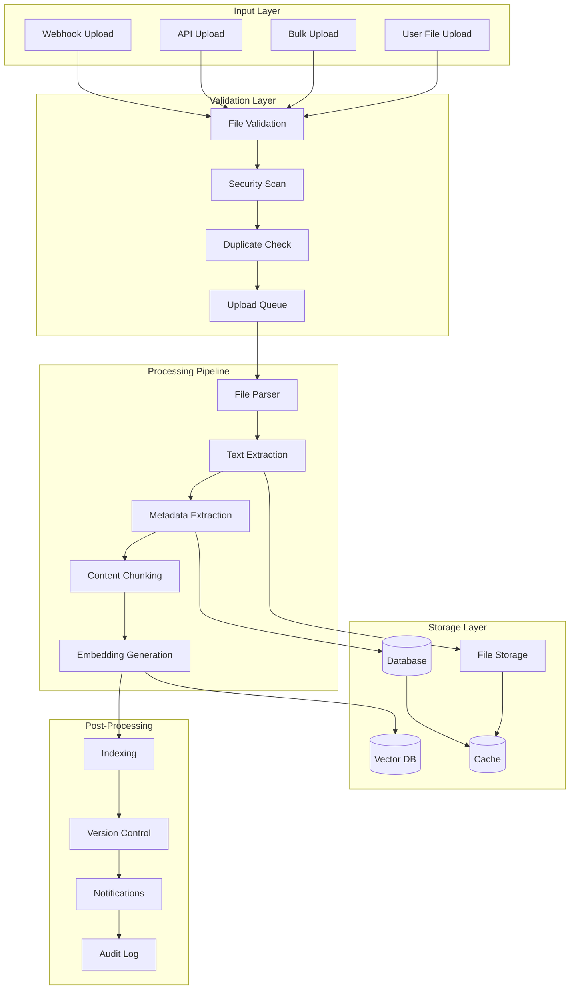

# Система обработки документов

## Обзор системы

Система обработки документов обеспечивает загрузку, парсинг, индексацию и управление корпоративными документами в форматах PDF, DOCX и TXT с поддержкой версионирования и автоматической обработки.

## Архитектура обработки документов



## Компоненты системы обработки

### 1. File Upload Handler

#### Обработчик загрузки файлов
```python
from typing import List, Dict, Any, Optional
from fastapi import UploadFile, HTTPException
import aiofiles
import hashlib
import magic
from pathlib import Path

class FileUploadHandler:
    def __init__(self, storage_path: str, max_file_size: int = 50 * 1024 * 1024):
        self.storage_path = Path(storage_path)
        self.max_file_size = max_file_size
        self.allowed_types = {
            'application/pdf': '.pdf',
            'application/vnd.openxmlformats-officedocument.wordprocessingml.document': '.docx',
            'text/plain': '.txt',
            'application/msword': '.doc'
        }
        
    async def handle_upload(
        self,
        file: UploadFile,
        user_id: int,
        metadata: Optional[Dict[str, Any]] = None
    ) -> Dict[str, Any]:
        """
        Обработка загрузки файла
        """
        try:
            # Валидация файла
            validation_result = await self.validate_file(file)
            if not validation_result["valid"]:
                raise HTTPException(
                    status_code=400,
                    detail=validation_result["error"]
                )
            
            # Чтение содержимого файла
            content = await file.read()
            await file.seek(0)
            
            # Генерация хеша для проверки дубликатов
            file_hash = hashlib.sha256(content).hexdigest()
            
            # Проверка на дубликаты
            existing_doc = await self.check_duplicate(file_hash)
            if existing_doc:
                return {
                    "status": "duplicate",
                    "existing_document_id": existing_doc["id"],
                    "message": "Файл уже существует в системе"
                }
            
            # Сохранение файла
            file_path = await self.save_file(file, content, file_hash)
            
            # Создание записи в БД
            document_data = {
                "title": metadata.get("title", file.filename),
                "description": metadata.get("description"),
                "file_name": file.filename,
                "file_path": str(file_path),
                "file_size": len(content),
                "file_type": validation_result["file_type"],
                "mime_type": validation_result["mime_type"],
                "content_hash": file_hash,
                "language": metadata.get("language", "ru"),
                "category": metadata.get("category"),
                "tags": metadata.get("tags", []),
                "uploaded_by": user_id,
                "metadata": metadata or {}
            }
            
            # Добавление в очередь обработки
            await self.queue_for_processing(document_data)
            
            return {
                "status": "uploaded",
                "file_hash": file_hash,
                "file_path": str(file_path),
                "message": "Файл успешно загружен и добавлен в очередь обработки"
            }
            
        except Exception as e:
            raise HTTPException(status_code=500, detail=f"Ошибка загрузки файла: {str(e)}")
    
    async def validate_file(self, file: UploadFile) -> Dict[str, Any]:
        """
        Валидация загружаемого файла
        """
        # Проверка размера файла
        if file.size and file.size > self.max_file_size:
            return {
                "valid": False,
                "error": f"Размер файла превышает максимально допустимый ({self.max_file_size} байт)"
            }
        
        # Чтение начала файла для определения типа
        content_start = await file.read(1024)
        await file.seek(0)
        
        # Определение MIME типа
        mime_type = magic.from_buffer(content_start, mime=True)
        
        # Проверка допустимого типа
        if mime_type not in self.allowed_types:
            return {
                "valid": False,
                "error": f"Неподдерживаемый тип файла: {mime_type}"
            }
        
        # Проверка расширения файла
        file_extension = Path(file.filename).suffix.lower()
        expected_extension = self.allowed_types[mime_type]
        
        if file_extension != expected_extension:
            return {
                "valid": False,
                "error": f"Расширение файла не соответствует содержимому"
            }
        
        return {
            "valid": True,
            "mime_type": mime_type,
            "file_type": expected_extension[1:],  # без точки
            "file_extension": file_extension
        }
    
    async def save_file(
        self, 
        file: UploadFile, 
        content: bytes, 
        file_hash: str
    ) -> Path:
        """
        Сохранение файла на диск
        """
        # Создание структуры папок по дате
        from datetime import datetime
        date_path = datetime.now().strftime("%Y/%m/%d")
        storage_dir = self.storage_path / date_path
        storage_dir.mkdir(parents=True, exist_ok=True)
        
        # Генерация уникального имени файла
        file_extension = Path(file.filename).suffix
        unique_filename = f"{file_hash}{file_extension}"
        file_path = storage_dir / unique_filename
        
        # Сохранение файла
        async with aiofiles.open(file_path, 'wb') as f:
            await f.write(content)
        
        return file_path
```

### 2. Document Parsers

#### Базовый парсер документов
```python
from abc import ABC, abstractmethod
from typing import Dict, Any, List

class BaseDocumentParser(ABC):
    def __init__(self):
        self.supported_extensions = []
        
    @abstractmethod
    async def parse(self, file_path: str) -> Dict[str, Any]:
        """
        Парсинг документа
        """
        pass
    
    @abstractmethod
    async def extract_metadata(self, file_path: str) -> Dict[str, Any]:
        """
        Извлечение метаданных
        """
        pass
    
    def supports_file(self, file_path: str) -> bool:
        """
        Проверка поддержки файла
        """
        extension = Path(file_path).suffix.lower()
        return extension in self.supported_extensions
```

#### PDF Parser
```python
import PyPDF2
import pdfplumber
from typing import Dict, Any, List

class PDFParser(BaseDocumentParser):
    def __init__(self):
        super().__init__()
        self.supported_extensions = ['.pdf']
        
    async def parse(self, file_path: str) -> Dict[str, Any]:
        """
        Парсинг PDF документа
        """
        try:
            # Использование pdfplumber для лучшего извлечения текста
            with pdfplumber.open(file_path) as pdf:
                text_content = ""
                pages_info = []
                
                for page_num, page in enumerate(pdf.pages, 1):
                    page_text = page.extract_text() or ""
                    text_content += page_text + "\n\n"
                    
                    # Извлечение информации о странице
                    page_info = {
                        "page_number": page_num,
                        "text_length": len(page_text),
                        "has_images": len(page.images) > 0,
                        "has_tables": len(page.extract_tables()) > 0
                    }
                    pages_info.append(page_info)
                
                # Извлечение таблиц
                tables = []
                for page in pdf.pages:
                    page_tables = page.extract_tables()
                    tables.extend(page_tables)
                
                return {
                    "text_content": text_content.strip(),
                    "page_count": len(pdf.pages),
                    "pages_info": pages_info,
                    "tables": tables,
                    "has_images": any(page["has_images"] for page in pages_info),
                    "has_tables": len(tables) > 0
                }
                
        except Exception as e:
            # Fallback на PyPDF2
            return await self._parse_with_pypdf2(file_path)
    
    async def _parse_with_pypdf2(self, file_path: str) -> Dict[str, Any]:
        """
        Fallback парсинг с PyPDF2
        """
        with open(file_path, 'rb') as file:
            pdf_reader = PyPDF2.PdfReader(file)
            text_content = ""
            
            for page in pdf_reader.pages:
                text_content += page.extract_text() + "\n\n"
            
            return {
                "text_content": text_content.strip(),
                "page_count": len(pdf_reader.pages),
                "pages_info": [],
                "tables": [],
                "has_images": False,
                "has_tables": False
            }
    
    async def extract_metadata(self, file_path: str) -> Dict[str, Any]:
        """
        Извлечение метаданных PDF
        """
        try:
            with open(file_path, 'rb') as file:
                pdf_reader = PyPDF2.PdfReader(file)
                metadata = pdf_reader.metadata or {}
                
                return {
                    "title": metadata.get("/Title", ""),
                    "author": metadata.get("/Author", ""),
                    "subject": metadata.get("/Subject", ""),
                    "creator": metadata.get("/Creator", ""),
                    "producer": metadata.get("/Producer", ""),
                    "creation_date": metadata.get("/CreationDate", ""),
                    "modification_date": metadata.get("/ModDate", ""),
                    "page_count": len(pdf_reader.pages),
                    "encrypted": pdf_reader.is_encrypted
                }
        except Exception as e:
            return {"error": str(e)}
```

#### DOCX Parser
```python
from docx import Document
from docx.shared import Inches
import xml.etree.ElementTree as ET

class DOCXParser(BaseDocumentParser):
    def __init__(self):
        super().__init__()
        self.supported_extensions = ['.docx']
        
    async def parse(self, file_path: str) -> Dict[str, Any]:
        """
        Парсинг DOCX документа
        """
        try:
            doc = Document(file_path)
            
            # Извлечение текста из параграфов
            paragraphs = []
            full_text = ""
            
            for para in doc.paragraphs:
                if para.text.strip():
                    paragraph_info = {
                        "text": para.text,
                        "style": para.style.name if para.style else "Normal",
                        "alignment": str(para.alignment) if para.alignment else None
                    }
                    paragraphs.append(paragraph_info)
                    full_text += para.text + "\n"
            
            # Извлечение таблиц
            tables = []
            for table in doc.tables:
                table_data = []
                for row in table.rows:
                    row_data = [cell.text.strip() for cell in row.cells]
                    table_data.append(row_data)
                tables.append(table_data)
            
            # Извлечение изображений
            images_info = []
            for rel in doc.part.rels.values():
                if "image" in rel.target_ref:
                    images_info.append({
                        "filename": rel.target_ref,
                        "content_type": rel.target_part.content_type
                    })
            
            return {
                "text_content": full_text.strip(),
                "paragraphs": paragraphs,
                "tables": tables,
                "images": images_info,
                "paragraph_count": len(paragraphs),
                "table_count": len(tables),
                "image_count": len(images_info)
            }
            
        except Exception as e:
            raise Exception(f"Ошибка парсинга DOCX: {str(e)}")
    
    async def extract_metadata(self, file_path: str) -> Dict[str, Any]:
        """
        Извлечение метаданных DOCX
        """
        try:
            doc = Document(file_path)
            core_props = doc.core_properties
            
            return {
                "title": core_props.title or "",
                "author": core_props.author or "",
                "subject": core_props.subject or "",
                "keywords": core_props.keywords or "",
                "comments": core_props.comments or "",
                "category": core_props.category or "",
                "created": core_props.created.isoformat() if core_props.created else "",
                "modified": core_props.modified.isoformat() if core_props.modified else "",
                "last_modified_by": core_props.last_modified_by or "",
                "revision": core_props.revision,
                "version": core_props.version or ""
            }
        except Exception as e:
            return {"error": str(e)}
```

#### TXT Parser
```python
import chardet
from typing import Dict, Any

class TXTParser(BaseDocumentParser):
    def __init__(self):
        super().__init__()
        self.supported_extensions = ['.txt']
        
    async def parse(self, file_path: str) -> Dict[str, Any]:
        """
        Парсинг текстового файла
        """
        try:
            # Определение кодировки
            with open(file_path, 'rb') as file:
                raw_data = file.read()
                encoding_result = chardet.detect(raw_data)
                encoding = encoding_result['encoding'] or 'utf-8'
            
            # Чтение файла с определенной кодировкой
            with open(file_path, 'r', encoding=encoding) as file:
                content = file.read()
            
            # Анализ структуры текста
            lines = content.split('\n')
            non_empty_lines = [line for line in lines if line.strip()]
            
            # Определение возможной структуры
            structure_info = await self._analyze_text_structure(content)
            
            return {
                "text_content": content,
                "encoding": encoding,
                "encoding_confidence": encoding_result['confidence'],
                "line_count": len(lines),
                "non_empty_line_count": len(non_empty_lines),
                "character_count": len(content),
                "word_count": len(content.split()),
                "structure": structure_info
            }
            
        except Exception as e:
            raise Exception(f"Ошибка парсинга TXT: {str(e)}")
    
    async def _analyze_text_structure(self, content: str) -> Dict[str, Any]:
        """
        Анализ структуры текстового документа
        """
        lines = content.split('\n')
        
        # Поиск заголовков (строки в верхнем регистре или с определенными паттернами)
        potential_headers = []
        for i, line in enumerate(lines):
            line = line.strip()
            if line and (line.isupper() or 
                        line.startswith('#') or 
                        line.endswith(':') or
                        len(line.split()) <= 5):
                potential_headers.append({
                    "line_number": i + 1,
                    "text": line,
                    "type": self._classify_header(line)
                })
        
        # Поиск списков
        list_items = []
        for i, line in enumerate(lines):
            line = line.strip()
            if (line.startswith(('•', '-', '*', '1.', '2.', '3.')) or
                line.startswith(tuple(f"{j}." for j in range(1, 100)))):
                list_items.append({
                    "line_number": i + 1,
                    "text": line
                })
        
        return {
            "potential_headers": potential_headers,
            "list_items": list_items,
            "has_structure": len(potential_headers) > 0 or len(list_items) > 0
        }
    
    def _classify_header(self, line: str) -> str:
        """
        Классификация типа заголовка
        """
        if line.startswith('#'):
            return "markdown_header"
        elif line.isupper():
            return "uppercase_header"
        elif line.endswith(':'):
            return "colon_header"
        else:
            return "potential_header"
    
    async def extract_metadata(self, file_path: str) -> Dict[str, Any]:
        """
        Извлечение метаданных текстового файла
        """
        import os
        from datetime import datetime
        
        try:
            stat = os.stat(file_path)
            
            return {
                "file_size": stat.st_size,
                "created": datetime.fromtimestamp(stat.st_ctime).isoformat(),
                "modified": datetime.fromtimestamp(stat.st_mtime).isoformat(),
                "accessed": datetime.fromtimestamp(stat.st_atime).isoformat()
            }
        except Exception as e:
            return {"error": str(e)}
```

### 3. Document Processing Pipeline

#### Основной процессор документов
```python
from typing import Dict, Any, List
import asyncio
from enum import Enum

class ProcessingStatus(Enum):
    PENDING = "pending"
    PROCESSING = "processing"
    COMPLETED = "completed"
    FAILED = "failed"

class DocumentProcessor:
    def __init__(
        self,
        parsers: Dict[str, BaseDocumentParser],
        embedding_service,
        chunking_service,
        database_service
    ):
        self.parsers = parsers
        self.embedding_service = embedding_service
        self.chunking_service = chunking_service
        self.database = database_service
        
    async def process_document(self, document_data: Dict[str, Any]) -> Dict[str, Any]:
        """
        Полная обработка документа
        """
        document_id = None
        try:
            # 1. Создание записи документа в БД
            document_id = await self.database.create_document(document_data)
            await self.database.update_document_status(
                document_id, ProcessingStatus.PROCESSING
            )
            
            # 2. Определение парсера
            file_path = document_data["file_path"]
            parser = self._get_parser_for_file(file_path)
            
            if not parser:
                raise Exception(f"Не найден парсер для файла: {file_path}")
            
            # 3. Парсинг документа
            parsing_result = await parser.parse(file_path)
            metadata_result = await parser.extract_metadata(file_path)
            
            # 4. Обновление документа с извлеченным контентом
            await self.database.update_document_content(
                document_id,
                parsing_result["text_content"],
                {**parsing_result, **metadata_result}
            )
            
            # 5. Разбиение на чанки
            chunks = await self.chunking_service.create_chunks(
                document_id,
                parsing_result["text_content"],
                document_data
            )
            
            # 6. Генерация embeddings
            chunk_texts = [chunk["content"] for chunk in chunks]
            embeddings = await self.embedding_service.generate_embeddings(chunk_texts)
            
            # 7. Сохранение чанков и embeddings
            await self.database.save_document_chunks(chunks, embeddings)
            
            # 8. Индексация в векторной БД
            await self.embedding_service.index_document_chunks(
                document_id, chunks, embeddings
            )
            
            # 9. Обновление статуса
            await self.database.update_document_status(
                document_id, ProcessingStatus.COMPLETED
            )
            
            return {
                "status": "success",
                "document_id": document_id,
                "chunks_created": len(chunks),
                "processing_info": {
                    "text_length": len(parsing_result["text_content"]),
                    "chunk_count": len(chunks),
                    "embedding_count": len(embeddings)
                }
            }
            
        except Exception as e:
            if document_id:
                await self.database.update_document_status(
                    document_id, ProcessingStatus.FAILED, str(e)
                )
            
            return {
                "status": "error",
                "document_id": document_id,
                "error": str(e)
            }
    
    def _get_parser_for_file(self, file_path: str) -> BaseDocumentParser:
        """
        Получение подходящего парсера для файла
        """
        for parser in self.parsers.values():
            if parser.supports_file(file_path):
                return parser
        return None
```

### 4. Content Chunking Service

#### Сервис разбиения контента на чанки
```python
import re
from typing import List, Dict, Any
from dataclasses import dataclass

@dataclass
class ChunkingConfig:
    chunk_size: int = 1000
    chunk_overlap: int = 200
    min_chunk_size: int = 100
    respect_sentence_boundaries: bool = True
    respect_paragraph_boundaries: bool = True

class ContentChunkingService:
    def __init__(self, config: ChunkingConfig = None):
        self.config = config or ChunkingConfig()
        
    async def create_chunks(
        self,
        document_id: int,
        content: str,
        document_metadata: Dict[str, Any]
    ) -> List[Dict[str, Any]]:
        """
        Создание чанков из контента документа
        """
        # Предварительная обработка текста
        cleaned_content = await self._preprocess_content(content)
        
        # Разбиение на чанки в зависимости от типа документа
        if document_metadata.get("file_type") == "pdf":
            chunks = await self._chunk_pdf_content(cleaned_content, document_metadata)
        elif document_metadata.get("file_type") == "docx":
            chunks = await self._chunk_docx_content(cleaned_content, document_metadata)
        else:
            chunks = await self._chunk_text_content(cleaned_content)
        
        # Добавление метаданных к чанкам
        enriched_chunks = []
        for i, chunk in enumerate(chunks):
            enriched_chunk = {
                "document_id": document_id,
                "chunk_index": i,
                "content": chunk["text"],
                "content_length": len(chunk["text"]),
                "metadata": {
                    **document_metadata,
                    "chunk_type": chunk.get("type", "text"),
                    "start_position": chunk.get("start_position", 0),
                    "end_position": chunk.get("end_position", len(chunk["text"])),
                    "page_number": chunk.get("page_number"),
                    "section": chunk.get("section")
                }
            }
            enriched_chunks.append(enriched_chunk)
        
        return enriched_chunks
    
    async def _preprocess_content(self, content: str) -> str:
        """
        Предварительная обработка контента
        """
        # Нормализация пробелов
        content = re.sub(r'\s+', ' ', content)
        
        # Удаление лишних переносов строк
        content = re.sub(r'\n\s*\n', '\n\n', content)
        
        # Очистка от специальных символов
        content = re.sub(r'[\x00-\x08\x0b\x0c\x0e-\x1f\x7f-\x84\x86-\x9f]', '', content)
        
        return content.strip()
    
    async def _chunk_text_content(self, content: str) -> List[Dict[str, Any]]:
        """
        Разбиение обычного текста на чанки
        """
        chunks = []
        
        # Разбиение на предложения
        sentences = await self._split_into_sentences(content)
        
        current_chunk = ""
        current_size = 0
        start_position = 0
        
        for sentence in sentences:
            sentence_size = len(sentence)
            
            # Проверка, помещается ли предложение в текущий чанк
            if (current_size + sentence_size > self.config.chunk_size and 
                current_size > self.config.min_chunk_size):
                
                # Сохранение текущего чанка
                chunks.append({
                    "text": current_chunk.strip(),
                    "type": "text",
                    "start_position": start_position,
                    "end_position": start_position + len(current_chunk)
                })
                
                # Создание нового чанка с перекрытием
                overlap_text = await self._get_overlap_text(
                    current_chunk, self.config.chunk_overlap
                )
                
                start_position += len(current_chunk) - len(overlap_text)
                current_chunk = overlap_text + " " + sentence
                current_size = len(current_chunk)
            else:
                current_chunk += " " + sentence
                current_size += sentence_size
        
        # Добавление последнего чанка
        if current_chunk.strip():
            chunks.append({
                "text": current_chunk.strip(),
                "type": "text",
                "start_position": start_position,
                "end_position": start_position + len(current_chunk)
            })
        
        return chunks
    
    async def _split_into_sentences(self, text: str) -> List[str]:
        """
        Разбиение текста на предложения
        """
        # Простое разбиение по точкам, восклицательным и вопросительным знакам
        sentence_endings = r'[.!?]+\s+'
        sentences = re.split(sentence_endings, text)
        
        # Фильтрация пустых предложений
        sentences = [s.strip() for s in sentences if s.strip()]
        
        return sentences
    
    async def _get_overlap_text(self, text: str, overlap_size: int) -> str:
        """
        Получение текста для перекрытия чанков
        """
        if len(text) <= overlap_size:
            return text
        
        # Попытка найти границу предложения для перекрытия
        overlap_text = text[-overlap_size:]
        sentence_start = overlap_text.find('. ')
        
        if sentence_start != -1:
            return overlap_text[sentence_start + 2:]
        else:
            return overlap_text
```

### 5. Version Control System

#### Система версионирования документов
```python
from typing import Dict, Any, List, Optional
from datetime import datetime
from enum import Enum

class VersionAction(Enum):
    CREATE = "create"
    UPDATE = "update"
    DELETE = "delete"
    RESTORE = "restore"

class DocumentVersionControl:
    def __init__(self, database_service):
        self.database = database_service
        
    async def create_version(
        self,
        document_id: int,
        action: VersionAction,
        user_id: int,
        changes: Dict[str, Any] = None,
        comment: str = None
    ) -> int:
        """
        Создание новой версии документа
        """
        # Получение текущей версии
        current_version = await self.database.get_document_version(document_id)
        new_version = (current_version or 0) + 1
        
        # Создание записи версии
        version_data = {
            "document_id": document_id,
            "version": new_version,
            "action": action.value,
            "user_id": user_id,
            "changes": changes or {},
            "comment": comment,
            "created_at": datetime.utcnow()
        }
        
        version_id = await self.database.create_document_version(version_data)
        
        # Обновление версии в основной таблице документов
        await self.database.update_document_version(document_id, new_version)
        
        return version_id
    
    async def get_version_history(
        self,
        document_id: int,
        limit: int = 50
    ) -> List[Dict[str, Any]]:
        """
        Получение истории версий документа
        """