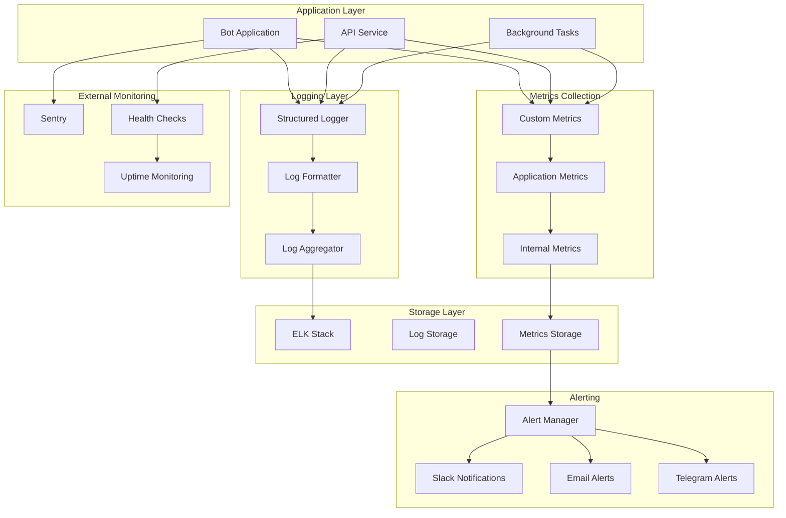

# Система логирования и мониторинга

## Обзор системы

Комплексная система логирования, мониторинга и аналитики для Telegram-бота с использованием структурированного логирования, метрик производительности и алертинга.

## Архитектура мониторинга



## Компоненты системы логирования

### 1. Structured Logger

#### Основной логгер системы
```python
import logging
import json
import sys
from datetime import datetime
from typing import Dict, Any, Optional
from contextvars import ContextVar
from pythonjsonlogger import jsonlogger

# Контекстные переменные для трассировки
request_id_var: ContextVar[str] = ContextVar('request_id', default='')
user_id_var: ContextVar[int] = ContextVar('user_id', default=0)
session_id_var: ContextVar[str] = ContextVar('session_id', default='')

class StructuredLogger:
    def __init__(self, name: str, level: str = "INFO"):
        self.logger = logging.getLogger(name)
        self.logger.setLevel(getattr(logging, level.upper()))
        
        # Настройка форматтера
        formatter = jsonlogger.JsonFormatter(
            fmt='%(asctime)s %(name)s %(levelname)s %(message)s',
            datefmt='%Y-%m-%d %H:%M:%S'
        )
        
        # Консольный хендлер
        console_handler = logging.StreamHandler(sys.stdout)
        console_handler.setFormatter(formatter)
        self.logger.addHandler(console_handler)
        
        # Файловый хендлер
        file_handler = logging.FileHandler('logs/app.log')
        file_handler.setFormatter(formatter)
        self.logger.addHandler(file_handler)
        
    def _add_context(self, extra: Dict[str, Any]) -> Dict[str, Any]:
        """
        Добавление контекстной информации к логу
        """
        context = {
            'request_id': request_id_var.get(),
            'user_id': user_id_var.get(),
            'session_id': session_id_var.get(),
            'timestamp': datetime.utcnow().isoformat(),
            'service': 'telegram_onboarding_bot'
        }
        
        # Объединение с дополнительными данными
        if extra:
            context.update(extra)
            
        return context
    
    def info(self, message: str, extra: Optional[Dict[str, Any]] = None):
        """
        Информационное логирование
        """
        self.logger.info(message, extra=self._add_context(extra))
    
    def warning(self, message: str, extra: Optional[Dict[str, Any]] = None):
        """
        Предупреждение
        """
        self.logger.warning(message, extra=self._add_context(extra))
    
    def error(self, message: str, extra: Optional[Dict[str, Any]] = None, exc_info: bool = True):
        """
        Ошибка
        """
        self.logger.error(message, extra=self._add_context(extra), exc_info=exc_info)
    
    def debug(self, message: str, extra: Optional[Dict[str, Any]] = None):
        """
        Отладочная информация
        """
        self.logger.debug(message, extra=self._add_context(extra))
    
    def critical(self, message: str, extra: Optional[Dict[str, Any]] = None):
        """
        Критическая ошибка
        """
        self.logger.critical(message, extra=self._add_context(extra))

# Глобальный логгер
logger = StructuredLogger("telegram_bot")
```

#### Специализированные логгеры
```python
class UserActivityLogger:
    def __init__(self, base_logger: StructuredLogger):
        self.logger = base_logger
        
    def log_user_action(
        self,
        user_id: int,
        action: str,
        details: Dict[str, Any] = None,
        success: bool = True
    ):
        """
        Логирование действий пользователя
        """
        extra = {
            'event_type': 'user_action',
            'user_id': user_id,
            'action': action,
            'success': success,
            'details': details or {}
        }
        
        if success:
            self.logger.info(f"User action: {action}", extra=extra)
        else:
            self.logger.warning(f"Failed user action: {action}", extra=extra)
    
    def log_search_query(
        self,
        user_id: int,
        query: str,
        results_count: int,
        response_time_ms: int,
        language: str = "ru"
    ):
        """
        Логирование поисковых запросов
        """
        extra = {
            'event_type': 'search_query',
            'user_id': user_id,
            'query_length': len(query),
            'results_count': results_count,
            'response_time_ms': response_time_ms,
            'language': language,
            'has_results': results_count > 0
        }
        
        self.logger.info("Search query executed", extra=extra)
    
    def log_document_access(
        self,
        user_id: int,
        document_id: int,
        access_type: str,
        success: bool = True
    ):
        """
        Логирование доступа к документам
        """
        extra = {
            'event_type': 'document_access',
            'user_id': user_id,
            'document_id': document_id,
            'access_type': access_type,
            'success': success
        }
        
        message = f"Document {access_type}: {document_id}"
        if success:
            self.logger.info(message, extra=extra)
        else:
            self.logger.warning(f"Failed {message}", extra=extra)

class SystemLogger:
    def __init__(self, base_logger: StructuredLogger):
        self.logger = base_logger
        
    def log_performance_metric(
        self,
        metric_name: str,
        value: float,
        unit: str = "ms",
        tags: Dict[str, str] = None
    ):
        """
        Логирование метрик производительности
        """
        extra = {
            'event_type': 'performance_metric',
            'metric_name': metric_name,
            'value': value,
            'unit': unit,
            'tags': tags or {}
        }
        
        self.logger.info(f"Performance metric: {metric_name}={value}{unit}", extra=extra)
    
    def log_system_event(
        self,
        event_type: str,
        message: str,
        severity: str = "info",
        details: Dict[str, Any] = None
    ):
        """
        Логирование системных событий
        """
        extra = {
            'event_type': 'system_event',
            'system_event_type': event_type,
            'severity': severity,
            'details': details or {}
        }
        
        if severity == "error":
            self.logger.error(message, extra=extra)
        elif severity == "warning":
            self.logger.warning(message, extra=extra)
        else:
            self.logger.info(message, extra=extra)
```

### 2. Metrics Collection

#### Prometheus метрики
```python
import time
from functools import wraps
from collections import defaultdict, deque
from typing import Dict, List, Any
import threading

# Внутренняя система метрик без prometheus
class InternalMetricsCollector:
    def __init__(self):
        self._lock = threading.Lock()
        self.request_counts = defaultdict(int)
        self.request_durations = defaultdict(list)
        self.active_users = defaultdict(int)
        self.search_queries = defaultdict(int)
        self.document_operations = defaultdict(int)
        self.rag_processing_times = defaultdict(list)
        self.cache_operations = defaultdict(int)
        self.error_counts = defaultdict(int)
        
    def increment_counter(self, metric_name: str, labels: Dict[str, str] = None):
        with self._lock:
            key = self._make_key(metric_name, labels)
            if metric_name == "requests":
                self.request_counts[key] += 1
            elif metric_name == "search_queries":
                self.search_queries[key] += 1
            elif metric_name == "document_operations":
                self.document_operations[key] += 1
            elif metric_name == "cache_operations":
                self.cache_operations[key] += 1
            elif metric_name == "errors":
                self.error_counts[key] += 1
    
    def record_duration(self, metric_name: str, duration: float, labels: Dict[str, str] = None):
        with self._lock:
            key = self._make_key(metric_name, labels)
            if metric_name == "request_duration":
                self.request_durations[key].append(duration)
                # Ограничиваем размер списка
                if len(self.request_durations[key]) > 1000:
                    self.request_durations[key] = self.request_durations[key][-500:]
            elif metric_name == "rag_processing":
                self.rag_processing_times[key].append(duration)
                if len(self.rag_processing_times[key]) > 1000:
                    self.rag_processing_times[key] = self.rag_processing_times[key][-500:]
    
    def set_gauge(self, metric_name: str, value: int, labels: Dict[str, str] = None):
        with self._lock:
            key = self._make_key(metric_name, labels)
            if metric_name == "active_users":
                self.active_users[key] = value
    
    def _make_key(self, metric_name: str, labels: Dict[str, str] = None) -> str:
        if not labels:
            return metric_name
        label_str = ",".join(f"{k}={v}" for k, v in sorted(labels.items()))
        return f"{metric_name}[{label_str}]"
    
    def get_metrics_summary(self) -> Dict[str, Any]:
        with self._lock:
            return {
                "request_counts": dict(self.request_counts),
                "avg_request_durations": {
                    k: sum(v) / len(v) if v else 0
                    for k, v in self.request_durations.items()
                },
                "active_users": dict(self.active_users),
                "search_queries": dict(self.search_queries),
                "document_operations": dict(self.document_operations),
                "avg_rag_processing_times": {
                    k: sum(v) / len(v) if v else 0
                    for k, v in self.rag_processing_times.items()
                },
                "cache_operations": dict(self.cache_operations),
                "error_counts": dict(self.error_counts)
            }

# Глобальный сборщик метрик
internal_metrics = InternalMetricsCollector()

class MetricsCollector:
    def __init__(self):
        self.start_time = time.time()
        
    def track_request(self, method: str, endpoint: str, status: str):
        """
        Отслеживание HTTP запросов
        """
        internal_metrics.increment_counter("requests", {
            "method": method,
            "endpoint": endpoint,
            "status": status
        })
    
    def track_search_query(self, language: str, has_results: bool):
        """
        Отслеживание поисковых запросов
        """
        internal_metrics.increment_counter("search_queries", {
            "language": language,
            "has_results": str(has_results).lower()
        })
    
    def track_document_operation(self, operation: str, status: str):
        """
        Отслеживание операций с документами
        """
        internal_metrics.increment_counter("document_operations", {
            "operation": operation,
            "status": status
        })
    
    def track_rag_processing(self, language: str, processing_time: float):
        """
        Отслеживание RAG обработки
        """
        internal_metrics.record_duration("rag_processing", processing_time, {
            "language": language
        })
    
    def track_cache_operation(self, operation: str, cache_type: str, result: str):
        """
        Отслеживание операций кэша
        """
        internal_metrics.increment_counter("cache_operations", {
            "operation": operation,
            "cache_type": cache_type,
            "result": result
        })
    
    def track_error(self, error_type: str, component: str):
        """
        Отслеживание ошибок
        """
        internal_metrics.increment_counter("errors", {
            "error_type": error_type,
            "component": component
        })
    
    def update_active_users(self, count: int, time_period: str):
        """
        Обновление количества активных пользователей
        """
        internal_metrics.set_gauge("active_users", count, {
            "time_period": time_period
        })

# Глобальный сборщик метрик
metrics = MetricsCollector()

# Декораторы для автоматического сбора метрик
def track_time(metric_name: str = None):
    """
    Декоратор для отслеживания времени выполнения
    """
    def decorator(func):
        @wraps(func)
        async def wrapper(*args, **kwargs):
            start_time = time.time()
            try:
                result = await func(*args, **kwargs)
                duration = time.time() - start_time
                
                if metric_name:
                    internal_metrics.record_duration("request_duration", duration, {
                        "method": "async",
                        "endpoint": metric_name
                    })
                
                return result
            except Exception as e:
                duration = time.time() - start_time
                metrics.track_error(type(e).__name__, func.__name__)
                raise
        return wrapper
    return decorator

def track_user_action(action: str):
    """
    Декоратор для отслеживания действий пользователя
    """
    def decorator(func):
        @wraps(func)
        async def wrapper(*args, **kwargs):
            try:
                result = await func(*args, **kwargs)
                internal_metrics.increment_counter("requests", {
                    "method": "user_action",
                    "endpoint": action,
                    "status": "success"
                })
                return result
            except Exception as e:
                internal_metrics.increment_counter("requests", {
                    "method": "user_action",
                    "endpoint": action,
                    "status": "error"
                })
                raise
        return wrapper
    return decorator
```

### 3. Health Checks

#### Система проверки здоровья
```python
from typing import Dict, Any, List
import asyncio
import aiohttp
from datetime import datetime

class HealthChecker:
    def __init__(self):
        self.checks = {}
        self.last_check_results = {}
        
    def register_check(self, name: str, check_func, critical: bool = True):
        """
        Регистрация проверки здоровья
        """
        self.checks[name] = {
            'func': check_func,
            'critical': critical
        }
    
    async def run_all_checks(self) -> Dict[str, Any]:
        """
        Выполнение всех проверок здоровья
        """
        results = {}
        overall_status = "healthy"
        
        for name, check_config in self.checks.items():
            try:
                start_time = time.time()
                result = await check_config['func']()
                duration = time.time() - start_time
                
                results[name] = {
                    'status': 'healthy' if result else 'unhealthy',
                    'duration_ms': round(duration * 1000, 2),
                    'critical': check_config['critical'],
                    'timestamp': datetime.utcnow().isoformat()
                }
                
                # Если критическая проверка не прошла
                if not result and check_config['critical']:
                    overall_status = "unhealthy"
                    
            except Exception as e:
                results[name] = {
                    'status': 'error',
                    'error': str(e),
                    'critical': check_config['critical'],
                    'timestamp': datetime.utcnow().isoformat()
                }
                
                if check_config['critical']:
                    overall_status = "unhealthy"
        
        self.last_check_results = results
        
        return {
            'status': overall_status,
            'timestamp': datetime.utcnow().isoformat(),
            'checks': results
        }
    
    async def get_health_status(self) -> Dict[str, Any]:
        """
        Получение текущего статуса здоровья
        """
        if not self.last_check_results:
            return await self.run_all_checks()
        
        return {
            'status': 'healthy' if all(
                check['status'] == 'healthy' 
                for check in self.last_check_results.values()
                if check.get('critical', True)
            ) else 'unhealthy',
            'last_check': datetime.utcnow().isoformat(),
            'checks': self.last_check_results
        }

# Конкретные проверки здоровья
async def check_database_connection():
    """
    Проверка подключения к базе данных
    """
    try:
        # Простой запрос к БД
        async with get_db_session() as session:
            result = await session.execute(text("SELECT 1"))
            return result.scalar() == 1
    except Exception:
        return False

async def check_redis_connection():
    """
    Проверка подключения к Redis
    """
    try:
        redis_client = get_redis_client()
        await redis_client.ping()
        return True
    except Exception:
        return False

async def check_qdrant_connection():
    """
    Проверка подключения к Qdrant
    """
    try:
        qdrant_client = get_qdrant_client()
        collections = await qdrant_client.get_collections()
        return True
    except Exception:
        return False

async def check_openai_api():
    """
    Проверка доступности OpenAI API
    """
    try:
        openai_client = get_openai_client()
        # Простой запрос к API
        response = await openai_client.chat.completions.create(
            model="gpt-3.5-turbo",
            messages=[{"role": "user", "content": "test"}],
            max_tokens=1
        )
        return True
    except Exception:
        return False

async def check_disk_space():
    """
    Проверка свободного места на диске
    """
    try:
        import shutil
        total, used, free = shutil.disk_usage("/")
        free_percent = (free / total) * 100
        return free_percent > 10  # Минимум 10% свободного места
    except Exception:
        return False

# Инициализация health checker
health_checker = HealthChecker()
health_checker.register_check("database", check_database_connection, critical=True)
health_checker.register_check("redis", check_redis_connection, critical=True)
health_checker.register_check("qdrant", check_qdrant_connection, critical=True)
health_checker.register_check("openai", check_openai_api, critical=False)
health_checker.register_check("disk_space", check_disk_space, critical=True)
```

### 4. Error Tracking and Alerting

#### Интеграция с Sentry
```python
import sentry_sdk
from sentry_sdk.integrations.asyncio import AsyncioIntegration
from sentry_sdk.integrations.sqlalchemy import SqlalchemyIntegration
from sentry_sdk.integrations.redis import RedisIntegration

def initialize_sentry(dsn: str, environment: str = "production"):
    """
    Инициализация Sentry для отслеживания ошибок
    """
    sentry_sdk.init(
        dsn=dsn,
        environment=environment,
        integrations=[
            AsyncioIntegration(),
            SqlalchemyIntegration(),
            RedisIntegration()
        ],
        traces_sample_rate=0.1,  # 10% трассировки для производительности
        send_default_pii=False,  # Не отправлять персональные данные
        before_send=filter_sensitive_data
    )

def filter_sensitive_data(event, hint):
    """
    Фильтрация чувствительных данных перед отправкой в Sentry
    """
    # Удаление токенов и паролей
    if 'extra' in event:
        for key in list(event['extra'].keys()):
            if any(sensitive in key.lower() for sensitive in ['token', 'password', 'secret', 'key']):
                event['extra'][key] = '[Filtered]'
    
    return event

class AlertManager:
    def __init__(self, webhook_urls: Dict[str, str]):
        self.webhook_urls = webhook_urls
        
    async def send_alert(
        self,
        alert_type: str,
        message: str,
        severity: str = "warning",
        details: Dict[str, Any] = None
    ):
        """
        Отправка алерта в различные каналы
        """
        alert_data = {
            'type': alert_type,
            'message': message,
            'severity': severity,
            'timestamp': datetime.utcnow().isoformat(),
            'details': details or {},
            'service': 'telegram_onboarding_bot'
        }
        
        # Отправка в Slack
        if 'slack' in self.webhook_urls:
            await self._send_slack_alert(alert_data)
        
        # Отправка в Telegram
        if 'telegram' in self.webhook_urls:
            await self._send_telegram_alert(alert_data)
        
        # Логирование алерта
        logger.warning(f"Alert sent: {alert_type}", extra=alert_data)
    
    async def _send_slack_alert(self, alert_data: Dict[str, Any]):
        """
        Отправка алерта в Slack
        """
        try:
            color = {
                'info': '#36a64f',
                'warning': '#ff9500',
                'error': '#ff0000',
                'critical': '#8b0000'
            }.get(alert_data['severity'], '#36a64f')
            
            slack_payload = {
                'attachments': [{
                    'color': color,
                    'title': f"🚨 {alert_data['type'].upper()}",
                    'text': alert_data['message'],
                    'fields': [
                        {
                            'title': 'Severity',
                            'value': alert_data['severity'].upper(),
                            'short': True
                        },
                        {
                            'title': 'Service',
                            'value': alert_data['service'],
                            'short': True
                        },
                        {
                            'title': 'Timestamp',
                            'value': alert_data['timestamp'],
                            'short': False
                        }
                    ]
                }]
            }
            
            async with aiohttp.ClientSession() as session:
                await session.post(
                    self.webhook_urls['slack'],
                    json=slack_payload
                )
                
        except Exception as e:
            logger.error(f"Failed to send Slack alert: {e}")
    
    async def _send_telegram_alert(self, alert_data: Dict[str, Any]):
        """
        Отправка алерта в Telegram
        """
        try:
            emoji = {
                'info': 'ℹ️',
                'warning': '⚠️',
                'error': '❌',
                'critical': '🔥'
            }.get(alert_data['severity'], 'ℹ️')
            
            message = f"""
{emoji} *{alert_data['type'].upper()}*

{alert_data['message']}

*Severity:* {alert_data['severity'].upper()}
*Service:* {alert_data['service']}
*Time:* {alert_data['timestamp']}
            """
            
            telegram_payload = {
                'text': message,
                'parse_mode': 'Markdown'
            }
            
            async with aiohttp.ClientSession() as session:
                await session.post(
                    self.webhook_urls['telegram'],
                    json=telegram_payload
                )
                
        except Exception as e:
            logger.error(f"Failed to send Telegram alert: {e}")
```

### 5. Analytics and Reporting

#### Система аналитики
```python
from datetime import datetime, timedelta
from typing import Dict, Any, List, Optional

class AnalyticsService:
    def __init__(self, database_service, cache_service):
        self.db = database_service
        self.cache = cache_service
        
    async def get_usage_analytics(
        self,
        start_date: datetime,
        end_date: datetime,
        granularity: str = "day"
    ) -> Dict[str, Any]:
        """
        Получение аналитики использования
        """
        cache_key = f"analytics:usage:{start_date.date()}:{end_date.date()}:{granularity}"
        cached_result = await self.cache.get(cache_key)
        if cached_result:
            return cached_result
        
        # Запрос к базе данных
        query = """
        SELECT 
            DATE_TRUNC(%s, created_at) as period,
            COUNT(DISTINCT user_id) as unique_users,
            COUNT(*) as total_interactions,
            AVG(processing_time_ms) as avg_response_time,
            COUNT(CASE WHEN event_type = 'search_query' THEN 1 END) as search_queries,
            COUNT(CASE WHEN event_type = 'document_access' THEN 1 END) as document_accesses
        FROM analytics_events 
        WHERE created_at BETWEEN %s AND %s
        GROUP BY period
        ORDER BY period
        """
        
        result = await self.db.execute(query, (granularity, start_date, end_date))
        analytics_data = [dict(row) for row in result.fetchall()]
        
        # Кэширование результата
        await self.cache.set(cache_key, analytics_data, ttl=3600)
        
        return {
            'period': f"{start_date.date()} to {end_date.date()}",
            'granularity': granularity,
            'data': analytics_data,
            'summary': await self._calculate_summary(analytics_data)
        }
    
    async def get_user_engagement_metrics(
        self,
        days: int = 30
    ) -> Dict[str, Any]:
        """
        Метрики вовлеченности пользователей
        """
        end_date = datetime.utcnow()
        start_date = end_date - timedelta(days=days)
        
        # Активные пользователи по дням
        daily_active_users = await self._get_daily_active_users(start_date, end_date)
        
        # Новые пользователи
        new_users = await self._get_new_users(start_date, end_date)
        
        # Retention rate
        retention_rate = await self._calculate_retention_rate(start_date, end_date)
        
        return {
            'period_days': days,
            'daily_active_users': daily_active_users,
            'new_users': new_users,
            'retention_rate': retention_rate,
            'total_active_users': len(set(user['user_id'] for user in daily_active_users))
        }
    
    async def get_search_analytics(
        self,
        days: int = 30
    ) -> Dict[str, Any]:
        """
        Аналитика поисковых запросов
        """
        end_date = datetime.utcnow()
        start_date = end_date - timedelta(days=days)
        
        query = """
        SELECT 
            language,
            COUNT(*) as query_count,
            AVG(results_count) as avg_results,
            AVG(response_time_ms) as avg_response_time,
            COUNT(CASE WHEN results_count > 0 THEN 1 END) as successful_queries
        FROM search_queries 
        WHERE created_at BETWEEN %s AND %s
        GROUP BY language
        ORDER BY query_count DESC
        """
        
        result = await self.db.execute(query, (start_date, end_date))
        search_data = [dict(row) for row in result.fetchall()]
        
        # Популярные запросы
        popular_queries = await self._get_popular_queries(start_date, end_date)
        
        return {
            'period_days': days,
            'by_language': search_data,
            'popular_queries': popular_queries,
            'total_queries': sum(row['query_count'] for row in search_data)
        }
    
    async def generate_daily_report(self) -> Dict[str, Any]:
        """
        Генерация ежедневного отчета
        """
        yesterday = datetime.utcnow() - timedelta(days=1)
        start_of_day = yesterday.replace(hour=0, minute=0, second=0, microsecond=0)
        end_of_day = yesterday.replace(hour=23, minute=59, second=59, microsecond=999999)
        
        # Основные метрики
        usage_analytics = await self.get_usage_analytics(start_of_day, end_of_day, "hour")
        search_analytics = await self.get_search_analytics(1)
        
        # Системные метрики
        system_health = await health_checker.get_health_status()
        cache_stats = await self.cache.get_stats()
        
        # Ошибки и предупреждения
        error_summary = await self._get_error_summary(start_of_day, end_of_day)
        
        return {
            'date': yesterday.date().isoformat(),
            'usage': usage_analytics,
            'search': search_analytics,
            'system_health': system_health,
            'cache_performance': cache_stats,
            'errors': error_summary,
            'generated_at': datetime.utcnow().isoformat()
        }
```

### 6. Monitoring Configuration

#### Prometheus конфигурация
```yaml
# internal_monitoring.yml
monitoring:
  enabled: true
  metrics_collection_interval: 15s
  health_check_interval: 30s
  
  endpoints:
    - name: 'telegram-bot'
      url: 'http://localhost:8000'
      metrics_path: '/metrics'
      check_interval: 10s
    
    - name: 'redis'
      url: 'http://localhost:6379'
      check_interval: 15s
    
    - name: 'postgres'
      url: 'http://localhost:5432'
      check_interval: 15s

alerting:
  enabled: true
  channels:
    - type: 'webhook'
      url: 'http://alertmanager:9093/api/v1/alerts'
```

#### Alert Rules
```yaml
# alert_rules.yml
groups:
  - name: telegram_bot_alerts
    rules:
      - alert: HighErrorRate
        expr: rate(telegram_bot_errors_total[5