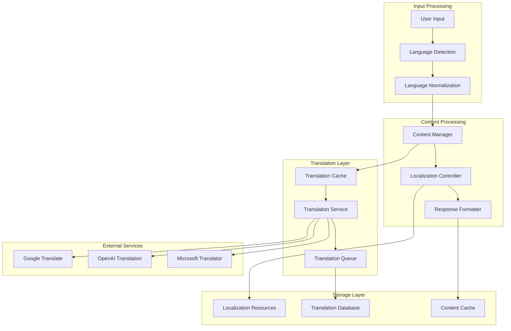

# Многоязычная поддержка системы

## Обзор многоязычной архитектуры

Система поддерживает три языка: русский (ru), английский (en) и арабский (ar) с автоматическим определением языка пользователя, переводом контента и локализацией интерфейса.

## Архитектура языковой поддержки



## Компоненты многоязычной системы

### 1. Language Detection Service

#### Автоматическое определение языка
```python
from langdetect import detect, detect_langs
from typing import Dict, List, Optional
import re

class LanguageDetectionService:
    def __init__(self):
        self.supported_languages = ["ru", "en", "ar"]
        self.default_language = "ru"
        self.confidence_threshold = 0.8
        
    async def detect_language(
        self, 
        text: str,
        fallback_language: Optional[str] = None
    ) -> Dict[str, Any]:
        """
        Определение языка текста с уверенностью
        """
        if not text or len(text.strip()) < 3:
            return {
                "language": fallback_language or self.default_language,
                "confidence": 0.0,
                "method": "fallback"
            }
            
        try:
            # Предварительная обработка текста
            cleaned_text = await self.preprocess_text(text)
            
            # Определение языка с уверенностью
            language_probs = detect_langs(cleaned_text)
            
            # Фильтрация поддерживаемых языков
            supported_probs = [
                prob for prob in language_probs 
                if prob.lang in self.supported_languages
            ]
            
            if supported_probs:
                best_match = supported_probs[0]
                
                return {
                    "language": best_match.lang,
                    "confidence": best_match.prob,
                    "method": "langdetect",
                    "alternatives": [
                        {"language": prob.lang, "confidence": prob.prob}
                        for prob in supported_probs[1:3]
                    ]
                }
            else:
                # Fallback на эвристические методы
                return await self.heuristic_detection(text, fallback_language)
                
        except Exception as e:
            return await self.heuristic_detection(text, fallback_language)
            
    async def heuristic_detection(
        self, 
        text: str, 
        fallback_language: Optional[str] = None
    ) -> Dict[str, Any]:
        """
        Эвристическое определение языка
        """
        # Проверка на арабские символы
        arabic_pattern = re.compile(r'[\u0600-\u06FF\u0750-\u077F\u08A0-\u08FF]')
        if arabic_pattern.search(text):
            return {
                "language": "ar",
                "confidence": 0.9,
                "method": "heuristic_arabic"
            }
            
        # Проверка на кириллицу
        cyrillic_pattern = re.compile(r'[а-яё]', re.IGNORECASE)
        if cyrillic_pattern.search(text):
            return {
                "language": "ru", 
                "confidence": 0.9,
                "method": "heuristic_cyrillic"
            }
            
        # Проверка на латиницу (английский по умолчанию)
        latin_pattern = re.compile(r'[a-z]', re.IGNORECASE)
        if latin_pattern.search(text):
            return {
                "language": "en",
                "confidence": 0.7,
                "method": "heuristic_latin"
            }
            
        return {
            "language": fallback_language or self.default_language,
            "confidence": 0.0,
            "method": "fallback"
        }
        
    async def preprocess_text(self, text: str) -> str:
        """
        Предварительная обработка текста для лучшего определения языка
        """
        # Удаление URL, email, номеров телефонов
        text = re.sub(r'http[s]?://(?:[a-zA-Z]|[0-9]|[$-_@.&+]|[!*\\(\\),]|(?:%[0-9a-fA-F][0-9a-fA-F]))+', '', text)
        text = re.sub(r'\S+@\S+', '', text)
        text = re.sub(r'\+?\d[\d\s\-\(\)]{7,}', '', text)
        
        # Удаление лишних пробелов и символов
        text = re.sub(r'\s+', ' ', text)
        text = text.strip()
        
        return text
```

### 2. Translation Service

#### Многопровайдерный сервис перевода
```python
from googletrans import Translator as GoogleTranslator
import openai
from typing import List, Dict, Any, Optional
import asyncio

class TranslationService:
    def __init__(self):
        self.google_translator = GoogleTranslator()
        self.openai_client = openai.AsyncOpenAI()
        self.supported_languages = ["ru", "en", "ar"]
        self.translation_cache = {}
        
    async def translate_text(
        self,
        text: str,
        target_language: str,
        source_language: Optional[str] = None,
        provider: str = "auto"
    ) -> Dict[str, Any]:
        """
        Перевод текста с выбором провайдера
        """
        # Проверка кэша
        cache_key = f"{hash(text)}:{source_language}:{target_language}"
        if cache_key in self.translation_cache:
            return self.translation_cache[cache_key]
            
        # Определение исходного языка если не указан
        if not source_language:
            detection_result = await self.detect_language(text)
            source_language = detection_result["language"]
            
        # Если языки одинаковые, возвращаем исходный текст
        if source_language == target_language:
            return {
                "translated_text": text,
                "source_language": source_language,
                "target_language": target_language,
                "provider": "none",
                "confidence": 1.0
            }
            
        # Выбор провайдера
        if provider == "auto":
            provider = await self.select_best_provider(
                text, source_language, target_language
            )
            
        # Выполнение перевода
        try:
            if provider == "google":
                result = await self.translate_with_google(
                    text, target_language, source_language
                )
            elif provider == "openai":
                result = await self.translate_with_openai(
                    text, target_language, source_language
                )
            else:
                # Fallback на Google
                result = await self.translate_with_google(
                    text, target_language, source_language
                )
                
            # Кэширование результата
            self.translation_cache[cache_key] = result
            
            return result
            
        except Exception as e:
            # Fallback стратегия
            return await self.fallback_translation(
                text, target_language, source_language, str(e)
            )
            
    async def translate_with_google(
        self,
        text: str,
        target_language: str,
        source_language: str
    ) -> Dict[str, Any]:
        """
        Перевод через Google Translate
        """
        try:
            result = self.google_translator.translate(
                text,
                src=source_language,
                dest=target_language
            )
            
            return {
                "translated_text": result.text,
                "source_language": result.src,
                "target_language": target_language,
                "provider": "google",
                "confidence": getattr(result, 'confidence', 0.8)
            }
        except Exception as e:
            raise Exception(f"Google Translate error: {str(e)}")
            
    async def translate_with_openai(
        self,
        text: str,
        target_language: str,
        source_language: str
    ) -> Dict[str, Any]:
        """
        Перевод через OpenAI
        """
        language_names = {
            "ru": "Russian",
            "en": "English", 
            "ar": "Arabic"
        }
        
        prompt = f"""
        Translate the following text from {language_names.get(source_language, source_language)} 
        to {language_names.get(target_language, target_language)}. 
        Maintain the original meaning and tone. Return only the translation.
        
        Text: {text}
        
        Translation:
        """
        
        try:
            response = await self.openai_client.chat.completions.create(
                model="gpt-3.5-turbo",
                messages=[
                    {"role": "system", "content": "You are a professional translator."},
                    {"role": "user", "content": prompt}
                ],
                temperature=0.3,
                max_tokens=1000
            )
            
            translated_text = response.choices[0].message.content.strip()
            
            return {
                "translated_text": translated_text,
                "source_language": source_language,
                "target_language": target_language,
                "provider": "openai",
                "confidence": 0.9
            }
        except Exception as e:
            raise Exception(f"OpenAI translation error: {str(e)}")
            
    async def select_best_provider(
        self,
        text: str,
        source_language: str,
        target_language: str
    ) -> str:
        """
        Выбор лучшего провайдера для перевода
        """
        # Для арабского языка предпочитаем OpenAI
        if source_language == "ar" or target_language == "ar":
            return "openai"
            
        # Для технических текстов предпочитаем OpenAI
        technical_keywords = [
            "api", "database", "server", "configuration",
            "deployment", "authentication", "authorization"
        ]
        
        if any(keyword in text.lower() for keyword in technical_keywords):
            return "openai"
            
        # По умолчанию Google Translate
        return "google"
        
    async def batch_translate(
        self,
        texts: List[str],
        target_language: str,
        source_language: Optional[str] = None,
        batch_size: int = 10
    ) -> List[Dict[str, Any]]:
        """
        Массовый перевод текстов
        """
        results = []
        
        for i in range(0, len(texts), batch_size):
            batch = texts[i:i + batch_size]
            
            # Параллельный перевод батча
            batch_tasks = [
                self.translate_text(text, target_language, source_language)
                for text in batch
            ]
            
            batch_results = await asyncio.gather(*batch_tasks, return_exceptions=True)
            
            for result in batch_results:
                if isinstance(result, Exception):
                    results.append({
                        "translated_text": "",
                        "error": str(result),
                        "provider": "error"
                    })
                else:
                    results.append(result)
                    
        return results
```

### 3. Localization System

#### Система локализации интерфейса
```python
import json
import os
from typing import Dict, Any, Optional

class LocalizationService:
    def __init__(self, locales_path: str = "config/locales"):
        self.locales_path = locales_path
        self.locales = {}
        self.default_locale = "ru"
        self.supported_locales = ["ru", "en", "ar"]
        
    async def load_locales(self):
        """
        Загрузка всех локализационных файлов
        """
        for locale in self.supported_locales:
            locale_file = os.path.join(self.locales_path, f"{locale}.json")
            
            if os.path.exists(locale_file):
                with open(locale_file, 'r', encoding='utf-8') as f:
                    self.locales[locale] = json.load(f)
            else:
                self.locales[locale] = {}
                
    def get_text(
        self,
        key: str,
        locale: str = None,
        **kwargs
    ) -> str:
        """
        Получение локализованного текста
        """
        locale = locale or self.default_locale
        
        # Получение текста из локали
        text = self._get_nested_value(self.locales.get(locale, {}), key)
        
        # Fallback на дефолтную локаль
        if not text and locale != self.default_locale:
            text = self._get_nested_value(
                self.locales.get(self.default_locale, {}), 
                key
            )
            
        # Fallback на ключ
        if not text:
            text = key
            
        # Форматирование с параметрами
        if kwargs:
            try:
                text = text.format(**kwargs)
            except (KeyError, ValueError):
                pass
                
        return text
        
    def _get_nested_value(self, data: Dict[str, Any], key: str) -> Optional[str]:
        """
        Получение значения по вложенному ключу (например, "buttons.start")
        """
        keys = key.split('.')
        current = data
        
        for k in keys:
            if isinstance(current, dict) and k in current:
                current = current[k]
            else:
                return None
                
        return current if isinstance(current, str) else None
        
    def get_keyboard_text(
        self,
        keyboard_type: str,
        locale: str = None
    ) -> Dict[str, str]:
        """
        Получение текстов для клавиатуры
        """
        locale = locale or self.default_locale
        keyboard_key = f"keyboards.{keyboard_type}"
        
        keyboard_data = self._get_nested_value(
            self.locales.get(locale, {}), 
            keyboard_key
        )
        
        if not keyboard_data and locale != self.default_locale:
            keyboard_data = self._get_nested_value(
                self.locales.get(self.default_locale, {}),
                keyboard_key
            )
            
        return keyboard_data or {}
```

### 4. Локализационные ресурсы

#### Русская локализация (config/locales/ru.json)
```json
{
  "commands": {
    "start": "Добро пожаловать в корпоративного бота онбординга! 👋",
    "help": "Доступные команды:",
    "search": "Поиск по документам",
    "profile": "Мой профиль",
    "settings": "Настройки"
  },
  "buttons": {
    "search_documents": "🔍 Поиск документов",
    "my_profile": "👤 Мой профиль", 
    "help": "❓ Помощь",
    "settings": "⚙️ Настройки",
    "language": "🌐 Язык",
    "back": "⬅️ Назад",
    "cancel": "❌ Отмена",
    "confirm": "✅ Подтвердить"
  },
  "messages": {
    "welcome": "Добро пожаловать, {name}! Я помогу вам с онбордингом.",
    "search_prompt": "Введите ваш вопрос или ключевые слова для поиска:",
    "no_results": "По вашему запросу ничего не найдено. Попробуйте переформулировать вопрос.",
    "processing": "Обрабатываю ваш запрос... ⏳",
    "error": "Произошла ошибка. Попробуйте позже.",
    "language_changed": "Язык изменен на русский 🇷🇺"
  },
  "keyboards": {
    "main_menu": {
      "search_documents": "🔍 Поиск документов",
      "my_profile": "👤 Мой профиль",
      "help": "❓ Помощь",
      "settings": "⚙️ Настройки"
    },
    "language_selection": {
      "russian": "🇷🇺 Русский",
      "english": "🇺🇸 English", 
      "arabic": "🇸🇦 العربية"
    }
  },
  "profile": {
    "title": "Ваш профиль",
    "name": "Имя: {name}",
    "department": "Отдел: {department}",
    "position": "Должность: {position}",
    "language": "Язык: {language}",
    "onboarding_progress": "Прогресс онбординга: {progress}%"
  },
  "search": {
    "results_found": "Найдено результатов: {count}",
    "source": "Источник: {source}",
    "confidence": "Уверенность: {confidence}%"
  }
}
```

#### Английская локализация (config/locales/en.json)
```json
{
  "commands": {
    "start": "Welcome to the corporate onboarding bot! 👋",
    "help": "Available commands:",
    "search": "Search documents",
    "profile": "My profile",
    "settings": "Settings"
  },
  "buttons": {
    "search_documents": "🔍 Search Documents",
    "my_profile": "👤 My Profile",
    "help": "❓ Help",
    "settings": "⚙️ Settings", 
    "language": "🌐 Language",
    "back": "⬅️ Back",
    "cancel": "❌ Cancel",
    "confirm": "✅ Confirm"
  },
  "messages": {
    "welcome": "Welcome, {name}! I'll help you with onboarding.",
    "search_prompt": "Enter your question or keywords to search:",
    "no_results": "No results found for your query. Try rephrasing your question.",
    "processing": "Processing your request... ⏳",
    "error": "An error occurred. Please try again later.",
    "language_changed": "Language changed to English 🇺🇸"
  },
  "keyboards": {
    "main_menu": {
      "search_documents": "🔍 Search Documents",
      "my_profile": "👤 My Profile",
      "help": "❓ Help",
      "settings": "⚙️ Settings"
    },
    "language_selection": {
      "russian": "🇷🇺 Русский",
      "english": "🇺🇸 English",
      "arabic": "🇸🇦 العربية"
    }
  },
  "profile": {
    "title": "Your Profile",
    "name": "Name: {name}",
    "department": "Department: {department}",
    "position": "Position: {position}",
    "language": "Language: {language}",
    "onboarding_progress": "Onboarding Progress: {progress}%"
  },
  "search": {
    "results_found": "Results found: {count}",
    "source": "Source: {source}",
    "confidence": "Confidence: {confidence}%"
  }
}
```

#### Арабская локализация (config/locales/ar.json)
```json
{
  "commands": {
    "start": "مرحباً بك في بوت التأهيل المؤسسي! 👋",
    "help": "الأوامر المتاحة:",
    "search": "البحث في المستندات",
    "profile": "ملفي الشخصي",
    "settings": "الإعدادات"
  },
  "buttons": {
    "search_documents": "🔍 البحث في المستندات",
    "my_profile": "👤 ملفي الشخصي",
    "help": "❓ المساعدة",
    "settings": "⚙️ الإعدادات",
    "language": "🌐 اللغة",
    "back": "⬅️ رجوع",
    "cancel": "❌ إلغاء",
    "confirm": "✅ تأكيد"
  },
  "messages": {
    "welcome": "مرحباً {name}! سأساعدك في عملية التأهيل.",
    "search_prompt": "أدخل سؤالك أو الكلمات المفتاحية للبحث:",
    "no_results": "لم يتم العثور على نتائج لاستفسارك. حاول إعادة صياغة السؤال.",
    "processing": "جاري معالجة طلبك... ⏳",
    "error": "حدث خطأ. يرجى المحاولة لاحقاً.",
    "language_changed": "تم تغيير اللغة إلى العربية 🇸🇦"
  },
  "keyboards": {
    "main_menu": {
      "search_documents": "🔍 البحث في المستندات",
      "my_profile": "👤 ملفي الشخصي",
      "help": "❓ المساعدة",
      "settings": "⚙️ الإعدادات"
    },
    "language_selection": {
      "russian": "🇷🇺 Русский",
      "english": "🇺🇸 English",
      "arabic": "🇸🇦 العربية"
    }
  },
  "profile": {
    "title": "ملفك الشخصي",
    "name": "الاسم: {name}",
    "department": "القسم: {department}",
    "position": "المنصب: {position}",
    "language": "اللغة: {language}",
    "onboarding_progress": "تقدم التأهيل: {progress}%"
  },
  "search": {
    "results_found": "النتائج الموجودة: {count}",
    "source": "المصدر: {source}",
    "confidence": "الثقة: {confidence}%"
  }
}
```

### 5. Multilingual Bot Integration

#### Middleware для определения языка
```python
from aiogram import BaseMiddleware
from aiogram.types import TelegramObject

class LanguageMiddleware(BaseMiddleware):
    def __init__(
        self, 
        language_detection_service: LanguageDetectionService,
        localization_service: LocalizationService
    ):
        self.language_detection = language_detection_service
        self.localization = localization_service
        
    async def __call__(
        self,
        handler,
        event: TelegramObject,
        data: Dict[str, Any]
    ) -> Any:
        # Получение пользователя
        user = data.get("user")
        
        # Определение языка пользователя
        if hasattr(event, 'text') and event.text:
            # Определение языка из сообщения
            detection_result = await self.language_detection.detect_language(
                event.text,
                fallback_language=user.preferred_language if user else "ru"
            )
            
            # Обновление предпочтительного языка пользователя
            if user and detection_result["confidence"] > 0.8:
                if user.preferred_language != detection_result["language"]:
                    user.preferred_language = detection_result["language"]
                    await update_user_language(user.id, detection_result["language"])
                    
        # Установка языка в контекст
        user_language = user.preferred_language if user else "ru"
        data["language"] = user_language
        data["_"] = lambda key, **kwargs: self.localization.get_text(
            key, user_language, **kwargs
        )
        
        return await handler(event, data)
```

#### Динамические клавиатуры с локализацией
```python
from aiogram.types import InlineKeyboardMarkup, InlineKeyboardButton

class LocalizedKeyboardBuilder:
    def __init__(self, localization_service: LocalizationService):
        self.localization = localization_service
        
    def build_main_menu(self, language: str) -> InlineKeyboardMarkup:
        """
        Построение главного меню с локализацией
        """
        keyboard_texts = self.localization.get_keyboard_text("main_menu", language)
        
        keyboard = InlineKeyboardMarkup(inline_keyboard=[
            [InlineKeyboardButton(
                text=keyboard_texts.get("search_documents", "🔍 Search"),
                callback_data="search_documents"
            )],
            [InlineKeyboardButton(
                text=keyboard_texts.get("my_profile", "👤 Profile"),
                callback_data="my_profile"
            )],
            [
                InlineKeyboardButton(
                    text=keyboard_texts.get("help", "❓ Help"),
                    callback_data="help"
                ),
                InlineKeyboardButton(
                    text=keyboard_texts.get("settings", "⚙️ Settings"),
                    callback_data="settings"
                )
            ]
        ])
        
        return keyboard
        
    def build_language_selection(self, current_language: str) -> InlineKeyboardMarkup:
        """
        Построение меню выбора языка
        """
        languages = [
            ("ru", "🇷🇺 Русский"),
            ("en", "🇺🇸 English"),
            ("ar", "🇸🇦 العربية")
        ]
        
        keyboard_buttons = []
        for lang_code, lang_name in languages:
            # Отметка текущего языка
            if lang_code == current_language:
                lang_name = f"✅ {lang_name}"
                
            keyboard_buttons.append([InlineKeyboardButton(
                text=lang_name,
                callback_data=f"set_language:{lang_code}"
            )])
            
        keyboard_buttons.append([InlineKeyboardButton(
            text="⬅️ Back",
            callback_data="back_to_settings"
        )])
        
        return InlineKeyboardMarkup(inline_keyboard=keyboard_buttons)
```

### 6. Content Adaptation

#### Адаптация контента под язык
```python
class ContentAdapter:
    def __init__(
        self,
        translation_service: TranslationService,
        localization_service: LocalizationService
    ):
        self.translation = translation_service
        self.localization = localization_service
        
    async def adapt_search_results(
        self,
        results: List[Dict[str, Any]],
        user_language: str,
        original_query_language: str
    ) -> List[Dict[str, Any]]:
        """
        Адаптация результатов поиска под язык пользователя
        """
        adapted_results = []
        
        for result in results:
            adapted_result = result.copy()
            
            # Перевод содержимого если необходимо
            if result.get("language") != user_language:
                translation_result = await self.translation.translate_text(
                    result["content"],
                    target_language=user_language,
                    source_language=result.get("language", "en")
                )
                
                adapted_result["content"] = translation_result["translated_text"]
                adapted_result["translated"] = True
                adapted_result["original_language"] = result.get("language")
                
            # Локализация метаданных
            if "category" in result:
                category_key = f"categories.{result['category']}"
                adapted_result["category_display"] = self.localization.get_text(
                    category_key, user_language
                )
                
            adapted_results.append(adapted_result)
            
        return adapted_results
        
    async def format_response_with_rtl(
        self,
        text: str,
        language: str
    ) -> str:
        """
        Форматирование ответа с учетом направления письма
        """
        if language == "ar":
            # Для арабского языка добавляем RTL маркеры
            return f"\u202E{text}\u202C"
        else:
            return text
```

### 7. Performance Optimization

#### Кэширование переводов
```python
import redis
import json
from typing import Optional

class TranslationCache:
    def __init__(self, redis_client: redis.Redis):
        self.redis = redis_client
        self.cache_prefix = "translation:"
        self.default_ttl = 86400  # 24 часа
        
    async def get_translation(
        self,
        text: str,
        source_lang: str,
        target_lang: str
    ) -> Optional[Dict[str, Any]]:
        """
        Получение перевода из кэша
        """
        cache_key = f"{self.cache_prefix}{hash(text)}:{source_lang}:{target_lang}"
        
        cached_data = await self.redis.get(cache_key)
        if cached_data:
            return json.loads(cached_data)