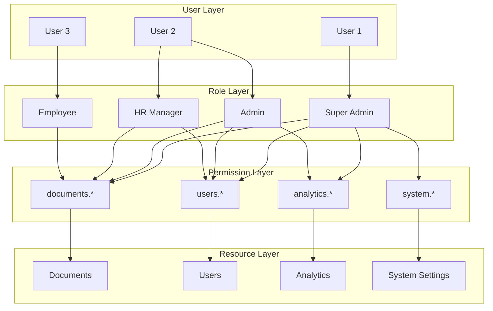

# Система ролей и доступов

## Обзор системы безопасности

Система использует Role-Based Access Control (RBAC) с поддержкой иерархических ролей, динамических разрешений и контекстно-зависимого доступа.

## Архитектура RBAC



## Определение ролей

### 1. Super Admin (super_admin)
**Описание**: Полный доступ ко всем функциям системы
**Разрешения**: `["*"]`
**Возможности**:
- Управление всеми пользователями и ролями
- Полный доступ к системным настройкам
- Управление всеми документами
- Доступ ко всей аналитике
- Управление инфраструктурой

```python
SUPER_ADMIN_PERMISSIONS = [
    "users.*",
    "roles.*", 
    "documents.*",
    "analytics.*",
    "system.*",
    "infrastructure.*"
]
```

### 2. Admin (admin)
**Описание**: Административный доступ к основным функциям
**Разрешения**: Управление пользователями, документами и аналитикой
**Возможности**:
- Создание и редактирование пользователей
- Назначение ролей (кроме super_admin)
- Управление документами
- Просмотр аналитики
- Модерация контента

```python
ADMIN_PERMISSIONS = [
    "users.create",
    "users.read", 
    "users.update",
    "users.delete",
    "users.assign_role",
    "documents.*",
    "analytics.read",
    "system.read"
]
```

### 3. HR Manager (hr_manager)
**Описание**: Управление процессом онбординга сотрудников
**Разрешения**: Работа с сотрудниками и документами HR
**Возможности**:
- Просмотр и редактирование профилей сотрудников
- Управление HR документами
- Отслеживание прогресса онбординга
- Создание отчетов по онбордингу

```python
HR_MANAGER_PERMISSIONS = [
    "users.read",
    "users.update",
    "users.onboarding.*",
    "documents.read",
    "documents.create",
    "documents.update",
    "documents.hr_category",
    "analytics.hr",
    "reports.onboarding"
]
```

### 4. Employee (employee)
**Описание**: Базовый доступ для сотрудников
**Разрешения**: Чтение документов и использование бота
**Возможности**:
- Поиск по документам
- Чтение доступных документов
- Использование чат-бота
- Обновление своего профиля

```python
EMPLOYEE_PERMISSIONS = [
    "documents.read",
    "search.*",
    "profile.read",
    "profile.update",
    "bot.use"
]
```

## Система разрешений

### Формат разрешений
Разрешения используют точечную нотацию с поддержкой wildcards:
- `users.*` - все операции с пользователями
- `documents.read` - только чтение документов
- `documents.category.hr` - доступ к HR документам
- `*` - полный доступ

### Иерархия разрешений
```python
PERMISSION_HIERARCHY = {
    "users": {
        "create": "Создание пользователей",
        "read": "Просмотр пользователей", 
        "update": "Редактирование пользователей",
        "delete": "Удаление пользователей",
        "assign_role": "Назначение ролей",
        "onboarding": {
            "read": "Просмотр прогресса онбординга",
            "update": "Обновление прогресса онбординга",
            "complete": "Завершение онбординга"
        }
    },
    "documents": {
        "create": "Создание документов",
        "read": "Просмотр документов",
        "update": "Редактирование документов", 
        "delete": "Удаление документов",
        "approve": "Одобрение документов",
        "category": {
            "hr": "HR документы",
            "tech": "Технические документы",
            "legal": "Юридические документы",
            "training": "Обучающие материалы"
        }
    },
    "analytics": {
        "read": "Просмотр аналитики",
        "export": "Экспорт данных",
        "hr": "HR аналитика",
        "usage": "Аналитика использования"
    },
    "system": {
        "read": "Просмотр системных настроек",
        "update": "Изменение системных настроек",
        "backup": "Создание резервных копий",
        "maintenance": "Техническое обслуживание"
    }
}
```

## Контекстно-зависимый доступ

### Доступ к документам по департаменту
```python
class DocumentAccessControl:
    def can_access_document(
        self, 
        user: User, 
        document: Document
    ) -> bool:
        # Публичные документы доступны всем
        if document.is_public:
            return True
            
        # Проверка прав по роли
        if self.has_permission(user, "documents.read"):
            return True
            
        # Проверка доступа по департаменту
        if (document.access_level == "department" and 
            user.department == document.department):
            return True
            
        # Проверка индивидуального доступа
        return self.has_individual_access(user, document)
```

### Временные разрешения
```python
class TemporaryAccess:
    def grant_temporary_access(
        self,
        user_id: int,
        permission: str,
        expires_at: datetime,
        granted_by: int
    ) -> bool:
        """
        Предоставление временного доступа
        """
        
    def check_temporary_access(
        self,
        user_id: int,
        permission: str
    ) -> bool:
        """
        Проверка временного доступа
        """
```

## Реализация системы безопасности

### Декоратор проверки разрешений
```python
from functools import wraps
from typing import List, Optional

def require_permission(
    permissions: List[str],
    resource_id: Optional[str] = None,
    context: Optional[Dict[str, Any]] = None
):
    """
    Декоратор для проверки разрешений
    """
    def decorator(func):
        @wraps(func)
        async def wrapper(*args, **kwargs):
            # Получение текущего пользователя
            current_user = get_current_user()
            
            # Проверка разрешений
            if not await check_permissions(
                current_user, 
                permissions, 
                resource_id, 
                context
            ):
                raise PermissionDeniedError(
                    f"Insufficient permissions: {permissions}"
                )
                
            return await func(*args, **kwargs)
        return wrapper
    return decorator

# Использование
@require_permission(["documents.create"])
async def create_document(document_data: DocumentCreate):
    pass

@require_permission(["users.update"], resource_id="user_id")
async def update_user(user_id: int, user_data: UserUpdate):
    pass
```

### Middleware для проверки доступа
```python
from fastapi import Request, HTTPException
from starlette.middleware.base import BaseHTTPMiddleware

class AuthorizationMiddleware(BaseHTTPMiddleware):
    async def dispatch(self, request: Request, call_next):
        # Пропуск публичных эндпоинтов
        if request.url.path in PUBLIC_ENDPOINTS:
            return await call_next(request)
            
        # Получение пользователя из токена
        user = await get_user_from_token(request)
        if not user:
            raise HTTPException(status_code=401, detail="Unauthorized")
            
        # Проверка доступа к эндпоинту
        required_permission = get_endpoint_permission(request.url.path)
        if required_permission and not await has_permission(user, required_permission):
            raise HTTPException(status_code=403, detail="Forbidden")
            
        # Добавление пользователя в контекст запроса
        request.state.user = user
        
        return await call_next(request)
```

### Сервис проверки разрешений
```python
class PermissionService:
    def __init__(self, db_session, cache_service):
        self.db = db_session
        self.cache = cache_service
        
    async def has_permission(
        self, 
        user: User, 
        permission: str,
        resource_id: Optional[str] = None,
        context: Optional[Dict[str, Any]] = None
    ) -> bool:
        """
        Проверка наличия разрешения у пользователя
        """
        # Кэширование результатов проверки
        cache_key = f"permission:{user.id}:{permission}:{resource_id}"
        cached_result = await self.cache.get(cache_key)
        if cached_result is not None:
            return cached_result
            
        # Получение ролей пользователя
        user_roles = await self.get_user_roles(user.id)
        
        # Проверка разрешений по ролям
        has_perm = False
        for role in user_roles:
            if await self.role_has_permission(role, permission):
                has_perm = True
                break
                
        # Проверка индивидуальных разрешений
        if not has_perm:
            has_perm = await self.user_has_individual_permission(
                user.id, permission
            )
            
        # Контекстная проверка
        if has_perm and context:
            has_perm = await self.check_context_permission(
                user, permission, context
            )
            
        # Кэширование результата
        await self.cache.set(cache_key, has_perm, ttl=300)
        
        return has_perm
        
    async def role_has_permission(self, role: Role, permission: str) -> bool:
        """
        Проверка наличия разрешения у роли
        """
        # Проверка wildcard разрешений
        if "*" in role.permissions:
            return True
            
        # Точное совпадение
        if permission in role.permissions:
            return True
            
        # Проверка иерархических разрешений
        permission_parts = permission.split(".")
        for role_permission in role.permissions:
            if role_permission.endswith("*"):
                role_prefix = role_permission[:-1]
                if permission.startswith(role_prefix):
                    return True
                    
        return False
```

## Telegram Bot интеграция

### Middleware для бота
```python
from aiogram import BaseMiddleware
from aiogram.types import TelegramObject

class AuthMiddleware(BaseMiddleware):
    async def __call__(
        self,
        handler,
        event: TelegramObject,
        data: Dict[str, Any]
    ) -> Any:
        # Получение пользователя
        telegram_id = event.from_user.id
        user = await get_user_by_telegram_id(telegram_id)
        
        if not user:
            # Регистрация нового пользователя
            user = await register_new_user(event.from_user)
            
        # Проверка активности пользователя
        if not user.is_active:
            await event.answer("Ваш аккаунт деактивирован")
            return
            
        # Добавление пользователя в контекст
        data["user"] = user
        data["permissions"] = await get_user_permissions(user)
        
        return await handler(event, data)
```

### Фильтры доступа для команд
```python
from aiogram.filters import BaseFilter

class RoleFilter(BaseFilter):
    def __init__(self, roles: List[str]):
        self.roles = roles
        
    async def __call__(self, message: Message, user: User) -> bool:
        user_roles = await get_user_roles(user.id)
        return any(role.name in self.roles for role in user_roles)

class PermissionFilter(BaseFilter):
    def __init__(self, permissions: List[str]):
        self.permissions = permissions
        
    async def __call__(self, message: Message, user: User) -> bool:
        for permission in self.permissions:
            if not await has_permission(user, permission):
                return False
        return True

# Использование в хендлерах
@router.message(Command("admin"), RoleFilter(["admin", "super_admin"]))
async def admin_command(message: Message, user: User):
    await message.answer("Добро пожаловать в админ панель!")

@router.message(Command("upload"), PermissionFilter(["documents.create"]))
async def upload_document(message: Message, user: User):
    await message.answer("Отправьте документ для загрузки")
```

## Аудит и логирование

### Логирование действий пользователей
```python
class AuditLogger:
    def __init__(self, db_session):
        self.db = db_session
        
    async def log_action(
        self,
        user_id: int,
        action: str,
        resource_type: str,
        resource_id: Optional[str] = None,
        details: Optional[Dict[str, Any]] = None,
        ip_address: Optional[str] = None
    ):
        """
        Логирование действий пользователя
        """
        audit_entry = AuditLog(
            user_id=user_id,
            action=action,
            resource_type=resource_type,
            resource_id=resource_id,
            details=details or {},
            ip_address=ip_address,
            timestamp=datetime.utcnow()
        )
        
        self.db.add(audit_entry)
        await self.db.commit()

# Использование в декораторе
def audit_action(action: str, resource_type: str):
    def decorator(func):
        @wraps(func)
        async def wrapper(*args, **kwargs):
            result = await func(*args, **kwargs)
            
            # Логирование после успешного выполнения
            await audit_logger.log_action(
                user_id=get_current_user().id,
                action=action,
                resource_type=resource_type,
                details={"args": args, "kwargs": kwargs}
            )
            
            return result
        return wrapper
    return decorator
```

### Мониторинг безопасности
```python
class SecurityMonitor:
    def __init__(self):
        self.failed_attempts = {}
        self.suspicious_activities = []
        
    async def track_failed_login(self, telegram_id: int, ip_address: str):
        """
        Отслеживание неудачных попыток входа
        """
        key = f"{telegram_id}:{ip_address}"
        self.failed_attempts[key] = self.failed_attempts.get(key, 0) + 1
        
        if self.failed_attempts[key] > 5:
            await self.block_user_temporarily(telegram_id)
            await self.send_security_alert(
                f"Multiple failed login attempts for user {telegram_id}"
            )
            
    async def detect_privilege_escalation(self, user_id: int, attempted_action: str):
        """
        Обнаружение попыток повышения привилегий
        """
        user = await get_user(user_id)
        if not await has_permission(user, attempted_action):
            await self.log_security_incident(
                user_id=user_id,
                incident_type="privilege_escalation",
                details={"attempted_action": attempted_action}
            )
```

## Конфигурация безопасности

### Настройки безопасности
```python
class SecuritySettings(BaseSettings):
    # JWT настройки
    JWT_SECRET_KEY: str
    JWT_ALGORITHM: str = "HS256"
    JWT_EXPIRATION_HOURS: int = 24
    
    # Сессии
    SESSION_TIMEOUT_MINUTES: int = 60
    MAX_CONCURRENT_SESSIONS: int = 3
    
    # Rate limiting
    MAX_REQUESTS_PER_MINUTE: int = 100
    MAX_FAILED_ATTEMPTS: int = 5
    LOCKOUT_DURATION_MINUTES: int = 15
    
    # Разрешения
    PERMISSION_CACHE_TTL: int = 300
    ROLE_HIERARCHY_ENABLED: bool = True
    
    # Аудит
    AUDIT_LOG_RETENTION_DAYS: int = 90
    SECURITY_ALERTS_ENABLED: bool = True
```

Эта система ролей и доступов обеспечивает:
- Гибкое управление разрешениями
- Безопасность на уровне API и Telegram бота
- Аудит всех действий пользователей
- Контекстно-зависимый доступ
- Мониторинг безопасности
- Масштабируемость для различных размеров организаций